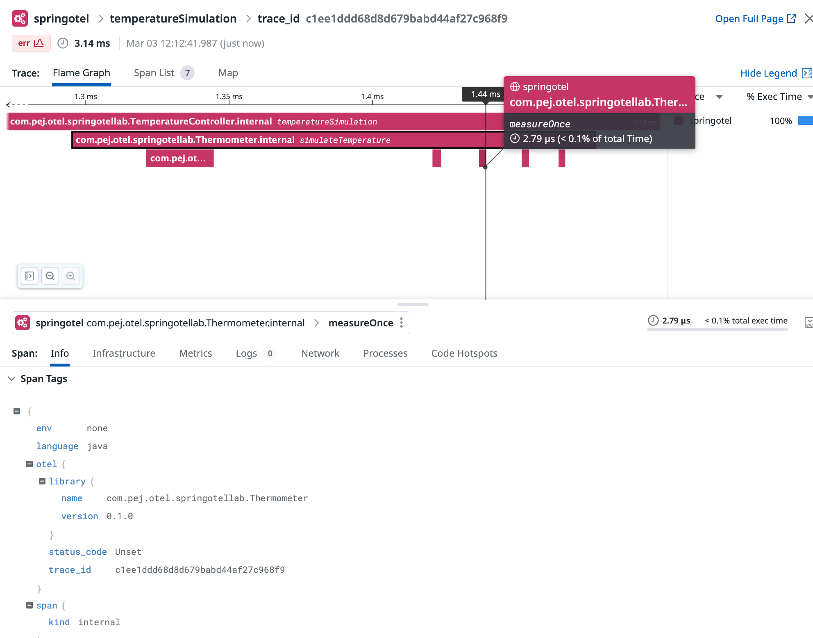

# Manual tracing: Span creation and management using the java Otel SDK


## Goal of this activity

This section provides a practical example of manual tracing where spans are generated using the Otel Java SDK. After familiarizing ourselves with automatic instrumentation using the java agent, we'll now modify our code to control how spans and traces are generated.


## Main steps

* Using the sdk and adding the necessary dependencies to the project 
* Gaining access to a `Tracer` instance
* Create a simple trace
* Add metadata and tag to our trace

We will use the following basic features of the OpenTelemetry API:


* a `Tracer` instance is used to create a span using a span builder via the `spanBuilder()` method.
* Each `span` is given a **name**
* The span gets started via the `startSpan()` method.
* each `span` must be finished by calling its `end()` method and this happens inside a scope.
* For a basic setup, you might choose the OTLP protocol to send the various observability signals (Traces, logs, metrics). It is an adaptable protocol and supported by many backends.


## Adding the sdk to the project


bootsrap the containers
(Make sure the `DD_API_KEY` and `DD_SITE` env variables are set)   

```bash
[root@pt-instance-1:~/oteljavalab]$ DD_SITE="your_site_value" DD_API_KEY="your_api_key_value" docker-compose up -d
Creating otel-collector ... done
Creating springotel     ... done
```

Accessing the container

<pre style="font-size: 12px">
[root@pt-instance-1:~/oteljavalab]$ docker exec -it springotel bash
[root@pt-instance-1:~/oteljavalab]$ 
</pre>


Going to the directory containing our project

<pre style="font-size: 12px">
[root@pt-instance-1:~/oteljavalab]$ cd section03/activity
[root@pt-instance-1:~/oteljavalab/section03/activity]$
</pre>

In order to add the sdk, we will simply add the following dependencies to the dependency block of the `build.gradle.kts` file

This should look like

```kotlin
dependencies {
        implementation("org.springframework.boot:spring-boot-starter-web")
        implementation("io.opentelemetry:opentelemetry-api")
        implementation("io.opentelemetry:opentelemetry-sdk")
        implementation("io.opentelemetry:opentelemetry-exporter-logging")
        implementation("io.opentelemetry.semconv:opentelemetry-semconv:1.23.1-alpha")
        implementation("io.opentelemetry:opentelemetry-exporter-otlp:1.35.0")

}
```


And to make sure that our dependencies are all aligned on the same version we will add that snippet right after the `plugin` block of the `build.gradle.kts` file


```kotlin
configurations.all {
	resolutionStrategy.eachDependency {
		if (requested.group == "io.opentelemetry" && requested.name !in listOf("opentelemetry-semconv","opentelemetry-api-events", "opentelemetry-extension-incubator")) {
			useVersion("1.35.0")

		}
	}
}
```


## Instantiate a tracer

In order to get an instance of our tracer, we leverage Spring's "dependency injection" capability through which the Spring container “injects” objects into other objects or “dependencies”. This tracer object is accessed through an object of type `OpenTelemetry` that needs to be created first.

For this we will declare a Bean inside the Application class `TemperatureApplication`. This mainly consists of annotating the following method using the `@Bean` annotation. This bean can later be accessed from the other classes by relying on Spring's dependency injection mechanisms (this happens by using the `@Autowired` annotation). This annotation allows Spring to resolve and inject collaborating beans into other beans.

We will actually refer to it later in the `TemperatureController` class. 

Simply put we will first declare a bean in the `Application` class to instantiate an OpenTelemetry object


Let's first add the following block in the `TemperatureApplication` class *after* the `main()` method:

```java
    @Bean
    public OpenTelemetry openTelemetry(){

        Resource resource = Resource.getDefault().toBuilder().put(ResourceAttributes.SERVICE_NAME, "springotel").build();

        OtlpGrpcSpanExporter otlpGrpcSpanExporter = OtlpGrpcSpanExporter.builder().setTimeout(2, TimeUnit.SECONDS).build();

        SdkTracerProvider setTracerProvider = SdkTracerProvider.builder()
                .addSpanProcessor(BatchSpanProcessor.builder(otlpGrpcSpanExporter).setScheduleDelay(100, TimeUnit.MILLISECONDS).build())
                .setResource(resource)
                .build();

        return OpenTelemetrySdk.builder().setTracerProvider(setTracerProvider).buildAndRegisterGlobal();

    }
```

**Note**: At this point, you will also need to consider importing the various classes manually that are needed if you use a Text editor or they will be inferred if you use an IDE (IntelliJ or VSCode).
If you have to do it manually, add the following lines to the existing import section of your `TemperatureApplication` class

```java

import io.opentelemetry.api.OpenTelemetry;
import io.opentelemetry.exporter.otlp.trace.OtlpGrpcSpanExporter;
import io.opentelemetry.sdk.OpenTelemetrySdk;
import io.opentelemetry.sdk.resources.Resource;
import io.opentelemetry.sdk.trace.SdkTracerProvider;
import io.opentelemetry.sdk.trace.export.BatchSpanProcessor;
import io.opentelemetry.semconv.ResourceAttributes;
import org.springframework.context.annotation.Bean;
import java.util.concurrent.TimeUnit;

```

Now in `TemperatureController` we will need to get a hold on the `OpenTelemetry` object so that we can create a tracer instance. For this we need to add the following lines immediately after the Logger instance declaration:

```java

    private final Tracer tracer;


    @Autowired
    TemperatureController(OpenTelemetry openTelemetry) {
       tracer = openTelemetry.getTracer(TemperatureController.class.getName(), "0.1.0");
    }
```

Declaring the tracer variable and using constructor injection to initialize the tracer. The OpenTelemetry object provides a getTracer() method that allows this. 


The corresponding packages to import are:

```java
import io.opentelemetry.api.OpenTelemetry;
import io.opentelemetry.api.trace.Tracer;
```


## Creating a span

It's time now to build and start spans in the `TemperatureController` class. And we can replicate the same steps in any other classes that contain methods we need to instrument.


Now that we can access the `Tracer` instance, let's add the tracing idioms in our code:
We will change the method implementation as follows:

Example with the `index()` method:

**_Before_**

```java
        if (measurements.isEmpty()) {
            throw new ResponseStatusException(HttpStatus.BAD_REQUEST, "Missing measurements parameter", null);
        }

        thermometer.setTemp(20, 35);
        List<Integer> result = thermometer.simulateTemperature(measurements.get());

        if (location.isPresent()) {
            logger.info("Temperature simulation for {}: {}", location.get(), result);
        } else {
            logger.info("Temperature simulation for an unspecified location: {}", result);
        }
        return result;
```

**_After_**

```java
        Span span = tracer.spanBuilder("temperatureSimulation").startSpan();
        try (Scope scope = span.makeCurrent()) {

            if (measurements.isEmpty()) {
                throw new ResponseStatusException(HttpStatus.BAD_REQUEST, "Missing measurements parameter", null);
            }

            thermometer.setTemp(20, 35);
            List<Integer> result = thermometer.simulateTemperature(measurements.get());

            if (location.isPresent()) {
                logger.info("Temperature simulation for {}: {}", location.get(), result);
            } else {
                logger.info("Temperature simulation for an unspecified location: {}", result);
            }
            return result;
        } catch(Throwable t) {
            span.recordException(t);
            throw t;
        } finally {
            span.end();
        }
    
```

Also making sure that these packages are present or manually adding them in the import section, if not imported automatically by the IDE.
If you have to do it manually, add the following to the import section of your `TemperatureController` class

```java
import io.opentelemetry.api.OpenTelemetry;
import io.opentelemetry.api.trace.Span;
import io.opentelemetry.api.trace.Tracer;
import io.opentelemetry.context.Scope;
```


### Observations

#### Before: Without instrumentation
- **Functionality**: This code block performs a temperature simulation operation based on the number of measurements requested. If the `measurements` parameter is missing, it throws an exception. It logs the result of the simulation, which varies depending on whether the `location` is specified.
- **Observability**: The observability in this snippet is limited to logging. It logs the outcome of the temperature simulation but doesn't provide deeper insights into the operation's execution, such as performance metrics, errors, or the operation's context in a larger transaction.

#### After: With manual instrumentation
- **Instrumentation introduction**: This snippet introduces manual instrumentation by wrapping the temperature simulation logic within a span. A span represents a single unit of work within a larger trace, allowing for detailed monitoring and analysis of the operation.
- **Span creation**: At the beginning of the operation, a new span named `temperatureSimulation` is started. This explicitly marks the start of an operation that you want to monitor.
- **Scope management**: The operation is enclosed within a try-with-resources statement that ensures the span's scope is correctly managed. The `scope` ensures that the `span` is considered the current active span within its block, which is crucial for correct tracing in asynchronous or multi-threaded environments.
- **Error handling**: The catch block captures any thrown exceptions, allowing the span to record these exceptions. This is valuable for debugging and monitoring, as it directly associates errors with the operation that caused them.
- **Span closure**: Finally, the span is ended in the finally block, marking the completion of the operation. Ending a span is crucial for accurate measurement of operation duration and for ensuring resources are correctly freed.
- **Enhanced observability**: With the span in place, the operation now contributes to a trace, providing insights into performance, errors, and the operation's relationship to other work units. This enhanced observability is invaluable for troubleshooting, performance tuning, and understanding system behavior.

#### Summary of differences
The key difference lies in the enhanced observability provided by manual instrumentation. While the first snippet relies solely on logging for observability, the second snippet uses OpenTelemetry spans to offer detailed insights into the operation's execution, including performance metrics and error tracking. This manual instrumentation allows developers and operators to better understand, monitor, and debug their applications, especially in complex, distributed systems.


## Creating additonal spans (child span)

Our plan is now to custom instrument the methods that are inside the `Thermometer` class (`simulateTemperature()` and `measureOnce()`). Here is how the change might look like:

#### Before: Without instrumentation

```java

public List<Integer> simulateTemperature(int measurements) {
    List<Integer> temperatures = new ArrayList<Integer>();
    for (int i = 0; i < measurements; i++) {
        temperatures.add(this.measureOnce());
    }
    return temperatures;
}


private int measureOnce() {
    return ThreadLocalRandom.current().nextInt(this.minTemp, this.maxTemp + 1);
}


```


The initial version of the `Thermometer` class is straightforward: it simulates temperature measurements without any observability into its operations beyond what could be logged or inferred externally. This simplicity is fine for basic operations but lacks the depth needed for troubleshooting, performance monitoring, and understanding the behavior in complex or distributed systems.

- The `simulateTemperature` method generates a list of random temperatures, simulating measurements.
- The `measureOnce` method generates a single temperature measurement.
- The `setTemp` method that acts as a setter method to set the temperature bounds

This design is functional but opaque; without external logs, there's no insight into how many measurements were taken, how long they took, or whether any issues occurred during the process.


#### After: With manual instrumentation

```java
private final Tracer tracer;

@Autowired
Thermometer(OpenTelemetry openTelemetry) {
   tracer = openTelemetry.getTracer(Thermometer.class.getName(), "0.1.0");
}

public List<Integer> simulateTemperature(int measurements) {
    List<Integer> temperatures = new ArrayList<Integer>();
    Span parentSpan = tracer.spanBuilder("simulateTemperature").startSpan();
    try (Scope scope = parentSpan.makeCurrent()){
        for (int i = 0; i < measurements; i++) {
            temperatures.add(this.measureOnce());
        }
        return temperatures;
    } finally {
        parentSpan.end();
    }
}


private int measureOnce() {
	Span childSpan = tracer.spanBuilder("measureOnce").startSpan();
	try {
       return ThreadLocalRandom.current().nextInt(this.minTemp, this.maxTemp + 1);
    } finally {
    	childSpan.end();
    }
}
```

With the following imports:

```java
import io.opentelemetry.api.OpenTelemetry;
import io.opentelemetry.api.trace.Span;
import io.opentelemetry.api.trace.Tracer;
import io.opentelemetry.context.Scope;
import org.springframework.beans.factory.annotation.Autowired;
import org.springframework.stereotype.Component;

import java.util.ArrayList;
import java.util.List;
import java.util.concurrent.ThreadLocalRandom;
```


The instrumented version introduces OpenTelemetry spans to provide visibility into the execution of temperature simulations. This change allows developers and operators to trace the execution of temperature measurements, offering insights into the system's behavior, performance characteristics, and potential issues.

- The constructor is extended to accept a `Tracer` object, enabling the creation of spans within the class methods.
- The `simulateTemperature` method now starts a span before generating temperature measurements, making this operation observable as a discrete unit of work in traces. The span is made the current active span, ensuring that any spans created within this context (such as those in `measureOnce`) are correctly nested as children.
- The `measureOnce` method also starts a span for each individual temperature measurement. This granular level of instrumentation provides insight into the performance and behavior of the temperature generation process itself, which could be critical for diagnosing issues or optimizing the simulation.

### Key benefits and differences

- **Visibility and debuggability**: The addition of spans makes the temperature simulation process transparent and observable. It's now possible to trace each operation, see how long it takes, and monitor for errors or anomalies.
- **Context propagation**: By making spans the current context, the changes ensure that the trace context is propagated correctly through the operations. This means that `measureOnce` operations are correctly recognized as part of the larger `simulateTemperature` operation, allowing for accurate representation of operation hierarchy in traces.
- **Performance monitoring**: With spans, you can now monitor the performance of both the overall temperature simulation and individual measurements. This can help identify bottlenecks or inefficiencies in the simulation logic.
- **Error detection**: Span error recording allows for immediate visibility into exceptions or issues within the simulated operations, facilitating quicker diagnosis and resolution.

In summary, the instrumentation of the `Thermometer` class with OpenTelemetry spans transforms it from a black box into a transparent, observable component of your application. This enhances the ability to monitor, debug, and optimize your application, providing crucial insights into its behavior and performance.

## Build, run and test the application

<pre style="font-size: 12px">
[root@pt-instance-1:~/oteljavalab/section03/activity]$ gradle build

BUILD SUCCESSFUL in 4s
4 actionable tasks: 4 executed

[root@pt-instance-1:~/oteljavalab/section03/activity]$ java -jar build/libs/springotel-0.0.1-SNAPSHOT.jar &
2024-03-02T12:11:25.450Z  INFO 30923 --- [           main] c.p.o.s.TemperatureApplication           : Starting TemperatureApplication v0.0.1-SNAPSHOT using Java 17.0.9 with PID 30923 (/root/oteljavalab/section03/activity/build/libs/springotel-0.0.1-SNAPSHOT.jar started by root in /root/oteljavalab/section03/activity)
2024-03-02T12:11:25.484Z  INFO 30923 --- [           main] c.p.o.s.TemperatureApplication           : No active profile set, falling back to 1 default profile: "default"
2024-03-02T12:11:27.116Z  INFO 30923 --- [           main] o.s.b.w.embedded.tomcat.TomcatWebServer  : Tomcat initialized with port 8080 (http)
2024-03-02T12:11:27.133Z  INFO 30923 --- [           main] o.apache.catalina.core.StandardService   : Starting service [Tomcat]
2024-03-02T12:11:27.134Z  INFO 30923 --- [           main] o.apache.catalina.core.StandardEngine    : Starting Servlet engine: [Apache Tomcat/10.1.18]
2024-03-02T12:11:27.189Z  INFO 30923 --- [           main] o.a.c.c.C.[Tomcat].[localhost].[/]       : Initializing Spring embedded WebApplicationContext
2024-03-02T12:11:27.193Z  INFO 30923 --- [           main] w.s.c.ServletWebServerApplicationContext : Root WebApplicationContext: initialization completed in 1561 ms
2024-03-02T12:11:28.023Z  INFO 30923 --- [           main] o.s.b.w.embedded.tomcat.TomcatWebServer  : Tomcat started on port 8080 (http) with context path ''
2024-03-02T12:11:28.051Z  INFO 30923 --- [           main] c.p.o.s.TemperatureApplication           : Started TemperatureApplication in 3.372 seconds (process running for 4.028)

</pre>

Generate a request from another terminal using curl **from within the container**

<pre style="font-size: 12px">

[root@pt-instance-1:~/oteljavalab/section03/activity]$ curl "localhost:8080/simulateTemperature?measurements=5&location=Paris"

[21,28,29,35,27]
</pre>


## Check the results in the Datadog UI (APM traces)

<p align="left">
  
</p>


To view the generated traces: https://app.datadoghq.com/apm/traces

## Tearing down the services

Exit the container

<pre style="font-size: 12px">
[root@pt-instance-1:~/oteljavalab/section03/activity]$ exit
[root@pt-instance-1:~/oteljavalab/section03/activity]$ 
</pre>

Graceful shutdown

<pre style="font-size: 12px">
[root@pt-instance-1:~/oteljavalab/section03/activity]$ docker-compose down
Stopping otel-collector ... done
Stopping springotel     ... done
Removing otel-collector ... done
Removing springotel     ... done
</pre>


## Final remark

At this stage, the objective is well achieved, we managed to instrument our application 
using the instrumentation api and the spans and traces are sent to the backend after 
having been processed by the Otel SDK.

