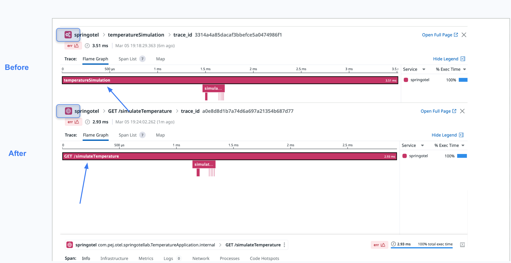

# Manual tracing: How to use attributes to change the span type, service names


## Goal of this activity

In this section of the OpenTelemetry tutorial, we will explore how to programmatically set or modify span attributes using the Java SDK. You'll learn to enrich your telemetry data by adding key-value pairs to spans, which can provide more context about the operation being traced. We'll cover how to use the `setAttribute` method to dynamically adjust span information, such as adding custom attributes or updating existing ones, enhancing the observability of your applications. This hands-on activity is designed to give you practical experience in manipulating span data to better understand the behavior of your software in a distributed system.

## Main steps

To achieve the goal of setting or changing span attributes programmatically using the Java SDK in OpenTelemetry, you will follow these main steps:

1. **Initialization of OpenTelemetry SDK**: Begin by setting up the OpenTelemetry SDK in your Java application. This involves configuring the SDK with the necessary exporters, span processors, and the TracerProvider.

2. **Creating a Tracer Instance**: Obtain a Tracer instance from the SDK. The Tracer is used to create spans and is typically obtained at the start of the application using the OpenTelemetry API.

3. **Starting a Span**: Use the Tracer to start a new span. This span will represent a unit of work in your application, such as a function call or a request handling process.

4. **Setting Span Attributes**: Once the span is started, use the `setAttribute` method on the span to add or modify attributes. Attributes are key-value pairs that provide additional context about the span, such as identifiers, flags, or parameters relevant to the operation being traced.

5. **Ending the Span**: After adding the necessary attributes and completing the unit of work, end the span to mark its completion. This will record the span's data and make it available for processing and export, depending on your SDK configuration.

6. **Exporting the Data**: Ensure that your telemetry data, including the enriched spans, is exported to a backend or analysis tool where you can visualize and investigate the traces.

By following these steps, you'll be able to programmatically enrich your spans with custom attributes, enhancing the observability and debuggability of your Java applications using OpenTelemetry.


## Adding the sdk to the project

In order to do so, we will simply add the following dependencies to the dependency bloc of the `build.gradle.kts` file

This should look like

```java
dependencies {
        compile("org.springframework.boot:spring-boot-starter-web")
        implementation("io.opentelemetry:opentelemetry-api")
	    implementation("io.opentelemetry:opentelemetry-sdk")
	    implementation("io.opentelemetry:opentelemetry-exporter-logging")
	    implementation("io.opentelemetry.semconv:opentelemetry-semconv:1.23.1-alpha")
	    implementation("io.opentelemetry:opentelemetry-exporter-otlp:1.35.0")

}
```

## Instantiate a tracer

In order to get an instance of our tracer, we leverage Spring's "dependency injection" capability through which the Spring container “injects” objects into other objects or “dependencies”. This tracer object is accessed through an object of type `OpenTelemetry` that needs to be created first.

For this we will declare a Bean inside the Application class `TemperatureApplication`. This mainly consists of annotating the following method using the `@Bean` annotation. This bean can later be accessed from the other classes by relying on Spring's dependeny injection mechanisms (this happens by using the `@Autowired` annotation). This annotation allows Spring to resolve and inject collaborating beans into other beans.

We will actually refer to it later in the `TemperatureController` class. 

Simply put we will first declare a bean in the `Application` class to instantiate a Tracer object


Let's first add the following block in the `TemperatureApplication` class *after* the `main()` method:

```java
    @Bean
    public Tracer tracer(){

        Resource resource = Resource.getDefault().toBuilder().put(ResourceAttributes.SERVICE_NAME, "springotel").build();

        OtlpGrpcSpanExporter otlpGrpcSpanExporter = OtlpGrpcSpanExporter.builder().setTimeout(2, TimeUnit.SECONDS).build();

        SdkTracerProvider setTracerProvider = SdkTracerProvider.builder()
                .addSpanProcessor(BatchSpanProcessor.builder(otlpGrpcSpanExporter).setScheduleDelay(100, TimeUnit.MILLISECONDS).build())
                .setResource(resource)
                .build();

        return OpenTelemetrySdk.builder().setTracerProvider(setTracerProvider).buildAndRegisterGlobal().getTracer(TemperatureApplication.class.getName(), "0.1.0");

    }
```

**Note**: At this point, you will also need to consider importing the various classes manually that are needed if you use a Text editor or they will be inferred if you use an IDE (IntelliJ or VSCode).
If you have to do it manually, add the following to the import section of your `TemperatureApplication` class

```java

import io.opentelemetry.api.trace.Tracer;
import io.opentelemetry.exporter.otlp.trace.OtlpGrpcSpanExporter;
import io.opentelemetry.sdk.OpenTelemetrySdk;
import io.opentelemetry.sdk.resources.Resource;
import io.opentelemetry.sdk.trace.SdkTracerProvider;
import io.opentelemetry.sdk.trace.export.BatchSpanProcessor;
import io.opentelemetry.semconv.ResourceAttributes;

```

Now in `TemperatureController` we will need to get a hold on the `Tracer` object so that we can create a tracer instance. For this we need to add the following lines immediately after the Logger instance declaration:

```java

    private final Tracer tracer;

    @Autowired
    TemperatureController(Tracer tracer) {
        this.tracer = tracer;
    }

```


The corresponding package to import is:

```java
import io.opentelemetry.api.trace.Tracer;
```


## Creating and starting a span

It's time now to build and start spans in the `TemperatureController` class. And we can replicate the same steps in any other classes that contains methods we need to instrument.


Now that we can access the `Tracer` instance, let's add the tracing idioms in our code:
We will change the method implementation as follows:

Example with the `index()` method:

**_Before_**

```java
        if (measurements.isEmpty()) {
            throw new ResponseStatusException(HttpStatus.BAD_REQUEST, "Missing measurements parameter", null);
        }

        thermometer.setTemp(20, 35);
        List<Integer> result = thermometer.simulateTemperature(measurements.get());

        if (location.isPresent()) {
            logger.info("Temperature simulation for {}: {}", location.get(), result);
        } else {
            logger.info("Temperature simulation for an unspecified location: {}", result);
        }
        return result;
```

**_After_**

```java
        Span span = tracer.spanBuilder("temperatureSimulation").startSpan();
        try (Scope scope = span.makeCurrent()) {

            if (measurements.isEmpty()) {
                throw new ResponseStatusException(HttpStatus.BAD_REQUEST, "Missing measurements parameter", null);
            }

            thermometer.setTemp(20, 35);
            List<Integer> result = thermometer.simulateTemperature(measurements.get());

            if (location.isPresent()) {
                logger.info("Temperature simulation for {}: {}", location.get(), result);
            } else {
                logger.info("Temperature simulation for an unspecified location: {}", result);
            }
            return result;
        } catch(Throwable t) {
            span.recordException(t);
            throw t;
        } finally {
            span.end();
        }
    
```

**Note**: At this point, you will also need to consider importing the various classes manually that are needed if you use a Text editor.
This is generally handled _automatically_ by IDEs (IntelliJ or Eclipse).
If you have to do it manually, add the following to the import section of your `TemperatureController` class

```java
import io.opentelemetry.api.trace.Span;
import io.opentelemetry.context.Scope;
```


## Setting span attributes

In order to do this we use the `setAttribute` method. We will slightly change the above snippet so that we can add details like resource names and span types.
In this example we will define a span type as "web" so that it will get rendered in the Datadog UI as a web component and specify the resource name which happens to be the name of the endpoint exposed by the spring controller (`/simulateTemperature`)

Here is how we do it

```java
        Span span = tracer.spanBuilder("temperatureSimulation").setAttribute("span.type", "web").setAttribute("resource.name", "GET /simulateTemperature").startSpan();
        try (Scope scope = span.makeCurrent()) {

            if (measurements.isEmpty()) {
                throw new ResponseStatusException(HttpStatus.BAD_REQUEST, "Missing measurements parameter", null);
            }

            thermometer.setTemp(20, 35);
            List<Integer> result = thermometer.simulateTemperature(measurements.get());

            if (location.isPresent()) {
                logger.info("Temperature simulation for {}: {}", location.get(), result);
            } else {
                logger.info("Temperature simulation for an unspecified location: {}", result);
            }
            return result;
        } catch(Throwable t) {
            span.recordException(t);
            throw t;
        } finally {
            span.end();
        }
    
```


## Observations

Using span attributes effectively is intrinsically linked to adhering to semantic conventions within the context of distributed tracing, especially when using OpenTelemetry. Semantic conventions are a set of guidelines and standardized attribute names that provide a uniform way to describe the nature of the span, the work it represents, and additional context about the operation being traced. These conventions facilitate consistency across different services and applications, enabling more straightforward analysis and monitoring across a distributed system.

Semantic conventions cover various aspects, including but not limited to:

- **Service identification**: Attributes that identify the service instance, such as `service.name`, and `service.version`, help in distinguishing between different services and versions within a traced system.
- **Operation details**: Standardized names for operations, such as HTTP method (`http.method`) and URL (`http.url`), database type (`db.system`), messaging system operation (`messaging.operation`), etc., provide clear, consistent descriptions of what a span represents.
- **Error handling**: Using attributes like `exception.type` and `exception.message` to record error information in a standardized format makes it easier to identify and analyze failures across different services and languages.
- **Network and infrastructure**: Attributes describing network operations (e.g., `net.peer.ip`, `net.peer.port`) and infrastructure details (e.g., `cloud.provider`, `container.id`) offer insights into the underlying infrastructure and network context of operations.

Adhering to these conventions when using span attributes ensures that telemetry data from various sources can be integrated and analyzed cohesively. It allows developers and SREs to query and visualize traces and metrics in a consistent manner across tools and platforms, such as Datadog, Prometheus, Grafana, etc.

For example, when you set a span attribute to categorize a span as a web component using `"span.type": "web"` or specify a resource name with `"resource.name"`, you are leveraging a form of semantic convention. Although `"span.type"` and `"resource.name"` in the given example might not strictly follow the OpenTelemetry semantic conventions, the principle is to use meaningful, standardized attributes to describe the span's context and purpose. The actual OpenTelemetry semantic conventions would use attributes like `http.method` and `http.route` to provide similar types of information for HTTP operations.

In essence, coupling span attributes with semantic conventions enhances the observability and operational insights of distributed systems by ensuring data consistency and interpretability across different telemetry sources and tools.

## Build, run and test the application

<pre style="font-size: 12px">
[root@pt-instance-1:~/oteljavalab/section04/activity]$ gradle build

BUILD SUCCESSFUL in 4s
4 actionable tasks: 4 executed

[root@pt-instance-1:~/oteljavalab/section03/activity]$ java -jar build/libs/springotellab-0.0.1-SNAPSHOT.jar &
2024-03-02T12:11:25.450Z  INFO 30923 --- [           main] c.p.o.s.TemperatureApplication           : Starting TemperatureApplication v0.0.1-SNAPSHOT using Java 17.0.9 with PID 30923 (/root/oteljavalab/section03/activity/build/libs/springotellab-0.0.1-SNAPSHOT.jar started by root in /root/oteljavalab/section03/activity)
2024-03-02T12:11:25.484Z  INFO 30923 --- [           main] c.p.o.s.TemperatureApplication           : No active profile set, falling back to 1 default profile: "default"
2024-03-02T12:11:27.116Z  INFO 30923 --- [           main] o.s.b.w.embedded.tomcat.TomcatWebServer  : Tomcat initialized with port 8080 (http)
2024-03-02T12:11:27.133Z  INFO 30923 --- [           main] o.apache.catalina.core.StandardService   : Starting service [Tomcat]
2024-03-02T12:11:27.134Z  INFO 30923 --- [           main] o.apache.catalina.core.StandardEngine    : Starting Servlet engine: [Apache Tomcat/10.1.18]
2024-03-02T12:11:27.189Z  INFO 30923 --- [           main] o.a.c.c.C.[Tomcat].[localhost].[/]       : Initializing Spring embedded WebApplicationContext
2024-03-02T12:11:27.193Z  INFO 30923 --- [           main] w.s.c.ServletWebServerApplicationContext : Root WebApplicationContext: initialization completed in 1561 ms
2024-03-02T12:11:28.023Z  INFO 30923 --- [           main] o.s.b.w.embedded.tomcat.TomcatWebServer  : Tomcat started on port 8080 (http) with context path ''
2024-03-02T12:11:28.051Z  INFO 30923 --- [           main] c.p.o.s.TemperatureApplication           : Started TemperatureApplication in 3.372 seconds (process running for 4.028)

</pre>

Generate a request from another terminal using curl (or from a browser or postman)

<pre style="font-size: 12px">

[root@pt-instance-1:~/oteljavalab/section04/activity]$ curl "localhost:8080/simulateTemperature?measurements=5&location=Paris"

[21,28,29,35,27]
</pre>


## Check the results in the Datadog UI (APM traces)

Visually you would be able to notice that across the tests (before and after the span attributes were set) the service widget was replaced from custom to web. And that the resource name has been changed from `temperatureSimulation` to `GET /simulateTemperature` 


<p align="left">
  
</p>


To view the generated traces: https://app.datadoghq.com/apm/traces

## End


