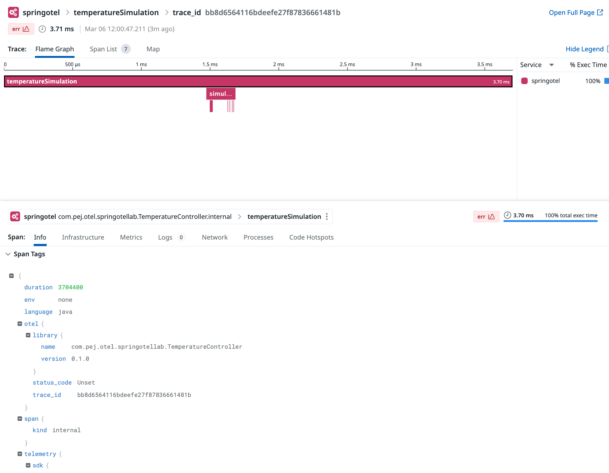

# Manual tracing: Automatic configuration of the SDK


## Goal of this activity

The `AutoConfiguredOpenTelemetrySdk` is a feature provided by the OpenTelemetry Java SDK that simplifies the process of configuring the OpenTelemetry SDK in an application. It aims to automate the setup of various components of the SDK based on the environment, system properties, and the presence of certain dependencies, making it easier to get started with OpenTelemetry without deep diving into manual configuration details. Here's an overview of its key aspects and benefits:


### Key features

1. **Automatic discovery and configuration**: `AutoConfiguredOpenTelemetrySdk` automatically discovers and configures SDK components like Span Exporters, Propagators, and Resource Providers. This means it can pick up configuration from environment variables, system properties, or configuration files without requiring explicit code to set these up.

2. **Flexible configuration**: While it provides sensible defaults and automatic configuration, `AutoConfiguredOpenTelemetrySdk` also offers hooks for customization. Developers can override the default settings through environment variables, system properties, or programmatically, allowing for detailed control over the behavior of the SDK.

3. **Simplifies SDK updates**: As OpenTelemetry evolves, new features and improvements are introduced. The automatic configuration mechanism abstracts away some of the complexities associated with upgrading the SDK, as it can automatically adapt to changes in available exporters, propagators, and other components.


### How it works

- When an application starts, `AutoConfiguredOpenTelemetrySdk` initializes the OpenTelemetry SDK by scanning for available components and configurations. It sets up the SDK based on found configurations, falling back to default settings when specific configurations are not provided.
- It configures the `TracerProvider`, metric `MeterProvider`, and the global `Propagators` based on this auto-discovered configuration.
- Developers can influence the auto-configuration process through various means, including:
  - **Environment variables**: Such as `OTEL_TRACES_EXPORTER` to specify which exporter to use for traces.
  - **System properties**: Parallel to environment variables, offering another way to configure the SDK.
  - **otel.javaagent.configuration-file**: A property pointing to a configuration file that provides detailed settings, useful for complex configurations that cannot be fully expressed through environment variables or system properties.


## Modifying the way the OpenTelemetry SDK is initialized

Accessing the container first

<pre style="font-size: 12px">
[root@pt-instance-1:~/oteljavalab]$ docker exec -it springotel bash
[root@pt-instance-1:~/oteljavalab]$ 
</pre>


Going to the directory containing our project

<pre style="font-size: 12px">
[root@pt-instance-1:~/oteljavalab]$ cd section05/activity
[root@pt-instance-1:~/oteljavalab/section05/activity]$
</pre>

Unlike what we did in the previous section, the way we initialize the SDK will differ.
We will change the block in our `TemperatureApplication` class from:

```java
    @Bean
    public OpenTelemetry openTelemetry(){

        Resource resource = Resource.getDefault().toBuilder().put(ResourceAttributes.SERVICE_NAME, "springotel").build();

        OtlpGrpcSpanExporter otlpGrpcSpanExporter = OtlpGrpcSpanExporter.builder().setTimeout(2, TimeUnit.SECONDS).build();

        SdkTracerProvider setTracerProvider = SdkTracerProvider.builder()
                .addSpanProcessor(BatchSpanProcessor.builder(otlpGrpcSpanExporter).setScheduleDelay(100, TimeUnit.MILLISECONDS).build())
                .setResource(resource)
                .build();

        return OpenTelemetrySdk.builder().setTracerProvider(setTracerProvider).buildAndRegisterGlobal();

    }
```

to 


```java
    @Bean
    public OpenTelemetry openTelemetry() {
        return AutoConfiguredOpenTelemetrySdk.initialize().getOpenTelemetrySdk();
    }
```


Previously we had to add much more details in that block by specifying `Resource`, `SpanExporter`, `BatchSpanProcessor`, and `TracerProvider`. You can observe that it is now a lot simpler.


Both use cases show different approaches to configuring and initializing the OpenTelemetry SDK within a Spring Boot application, each with its own set of advantages and considerations.


### Automatic configuration of the SDK

**Key characteristics**:
- **Automatic configuration**: This approach leverages `AutoConfiguredOpenTelemetrySdk`, which automatically configures the OpenTelemetry SDK based on the environment, system properties, and possibly configuration files. It simplifies setup by automatically detecting and configuring exporters, propagators, resource attributes, and more.
- **Ease of use**: Ideal for getting started quickly or when you want to minimize manual configuration. It's particularly useful when the default configuration and automatic discovery mechanisms align well with your application's needs.
- **Flexibility and extensibility**: While it provides a simple setup, it might be less flexible if specific custom configurations are required that cannot be easily achieved through the environment or system properties.


### Manual configuration of the SDK

**Key characteristics**:
- **Manual configuration**: This approach involves manually configuring each component of the OpenTelemetry SDK, such as the `Resource`, `SpanExporter`, `BatchSpanProcessor`, and `TracerProvider`. It offers precise control over the SDK's configuration.
- **Customizable**: It's suitable for applications with specific requirements that cannot be met through automatic configuration alone. For example, setting specific attributes, customizing the exporter timeout, or using a particular batch processing strategy.
- **Complexity**: This method requires a deeper understanding of OpenTelemetry's configuration options and might result in more boilerplate code. It's more appropriate for applications with specific observability needs that justify the additional configuration effort.

### Comparison summary

- The **first approach** is recommended for applications that can work well with standard configurations or when you prefer simplicity and are willing to adhere to the configurations that can be automatically determined by OpenTelemetry's auto-configuration capabilities.
- The **second approach** is better suited for applications that require precise control over the telemetry data, such as custom resource attributes, specific exporter settings, or when integrating with systems that need specific customizations not supported by auto-configuration.


## Build, run and test the application


We will also take advantage of the AutoConfigureSDK capabilities that allows for example to use env variables or system properies to specify certain settings:


```java
[root@pt-instance-1:~/oteljavalab/section05/activity]$ env OTEL_SERVICE_NAME=springotel OTEL_TRACES_EXPORTER=otlp OTEL_METRICS_EXPORTER=otlp OTEL_LOGS_EXPORTER=otlp java -jar build/libs/springtotel-0.0.1-SNAPSHOT.jar
```

In this example we can give a service name to our application or specify the type of exporters we would like to use.
For a more complete list of parameters, you might want to consult them here:

[AutoConfigureSDK settings](https://github.com/open-telemetry/opentelemetry-java/tree/main/sdk-extensions/autoconfigure)


<pre style="font-size: 12px">
[root@pt-instance-1:~/oteljavalab/section05/activity]$ gradle build

BUILD SUCCESSFUL in 4s
4 actionable tasks: 4 executed
</pre>

### Using the logging exporter

For debugging puroposes, it can come quite handy to output the result of our instrumentation rather than sending them right away to the collector. 
`OTEL_TRACES_EXPORTER=logging` configures the application to use an exporter that writes all traces to the console.

The below output shows the result of the requests made against the endpoint exposed:

<pre style="font-size: 12px">

[root@pt-instance-1:~/oteljavalab/section05/activity]$ env OTEL_SERVICE_NAME=springotel OTEL_TRACES_EXPORTER=logging OTEL_METRICS_EXPORTER=logging OTEL_LOGS_EXPORTER=logging java -jar build/libs/springtotel-0.0.1-SNAPSHOT.jar 
2024-03-06T10:42:23.376Z  INFO 2274086 --- [           main] c.p.o.s.TemperatureApplication           : Starting TemperatureApplication v0.0.1-SNAPSHOT using Java 17.0.9 with PID 2274086 (/root/oteljavalab/section05/activity/build/libs/springtotel-0.0.1-SNAPSHOT.jar started by root in /root/oteljavalab/section05)
2024-03-06T10:42:23.396Z  INFO 2274086 --- [           main] c.p.o.s.TemperatureApplication           : No active profile set, falling back to 1 default profile: "default"
2024-03-06T10:42:24.830Z  INFO 2274086 --- [           main] o.s.b.w.embedded.tomcat.TomcatWebServer  : Tomcat initialized with port 8080 (http)
2024-03-06T10:42:24.848Z  INFO 2274086 --- [           main] o.apache.catalina.core.StandardService   : Starting service [Tomcat]
2024-03-06T10:42:24.848Z  INFO 2274086 --- [           main] o.apache.catalina.core.StandardEngine    : Starting Servlet engine: [Apache Tomcat/10.1.18]
2024-03-06T10:42:24.914Z  INFO 2274086 --- [           main] o.a.c.c.C.[Tomcat].[localhost].[/]       : Initializing Spring embedded WebApplicationContext
2024-03-06T10:42:24.916Z  INFO 2274086 --- [           main] w.s.c.ServletWebServerApplicationContext : Root WebApplicationContext: initialization completed in 1386 ms
2024-03-06T10:42:25.543Z  INFO 2274086 --- [           main] o.s.b.w.embedded.tomcat.TomcatWebServer  : Tomcat started on port 8080 (http) with context path ''
2024-03-06T10:42:25.568Z  INFO 2274086 --- [           main] c.p.o.s.TemperatureApplication           : Started TemperatureApplication in 2.859 seconds (process running for 3.507)
2024-03-06T10:42:42.356Z  INFO 2274086 --- [nio-8080-exec-1] o.a.c.c.C.[Tomcat].[localhost].[/]       : Initializing Spring DispatcherServlet 'dispatcherServlet'
2024-03-06T10:42:42.357Z  INFO 2274086 --- [nio-8080-exec-1] o.s.web.servlet.DispatcherServlet        : Initializing Servlet 'dispatcherServlet'
2024-03-06T10:42:42.358Z  INFO 2274086 --- [nio-8080-exec-1] o.s.web.servlet.DispatcherServlet        : Completed initialization in 1 ms
2024-03-06T10:42:42.426Z  INFO 2274086 --- [nio-8080-exec-1] i.o.e.logging.LoggingSpanExporter        : 'measureOnce' : 6a1b4b0bb18a0aeb6d9a85dc9fff2182 0c24528076e920ca INTERNAL [tracer: com.pej.otel.springotellab.Thermometer:0.1.0] {}
2024-03-06T10:42:42.427Z  INFO 2274086 --- [nio-8080-exec-1] i.o.e.logging.LoggingSpanExporter        : 'measureOnce' : 6a1b4b0bb18a0aeb6d9a85dc9fff2182 e381f7046e6f8e68 INTERNAL [tracer: com.pej.otel.springotellab.Thermometer:0.1.0] {}
2024-03-06T10:42:42.427Z  INFO 2274086 --- [nio-8080-exec-1] i.o.e.logging.LoggingSpanExporter        : 'measureOnce' : 6a1b4b0bb18a0aeb6d9a85dc9fff2182 272b754e38f840b7 INTERNAL [tracer: com.pej.otel.springotellab.Thermometer:0.1.0] {}
2024-03-06T10:42:42.427Z  INFO 2274086 --- [nio-8080-exec-1] i.o.e.logging.LoggingSpanExporter        : 'measureOnce' : 6a1b4b0bb18a0aeb6d9a85dc9fff2182 3488f9b6ee4c3315 INTERNAL [tracer: com.pej.otel.springotellab.Thermometer:0.1.0] {}
2024-03-06T10:42:42.427Z  INFO 2274086 --- [nio-8080-exec-1] i.o.e.logging.LoggingSpanExporter        : 'measureOnce' : 6a1b4b0bb18a0aeb6d9a85dc9fff2182 cea5d2829b15bf5f INTERNAL [tracer: com.pej.otel.springotellab.Thermometer:0.1.0] {}
2024-03-06T10:42:42.427Z  INFO 2274086 --- [nio-8080-exec-1] i.o.e.logging.LoggingSpanExporter        : 'simulateTemperature' : 6a1b4b0bb18a0aeb6d9a85dc9fff2182 5f492a822c27a95a INTERNAL [tracer: com.pej.otel.springotellab.Thermometer:0.1.0] {}
2024-03-06T10:42:42.427Z  INFO 2274086 --- [nio-8080-exec-1] c.p.o.s.TemperatureController            : Temperature simulation for Paris: [33, 23, 26, 25, 27]
2024-03-06T10:42:42.429Z  INFO 2274086 --- [nio-8080-exec-1] i.o.e.logging.LoggingSpanExporter        : 'temperatureSimulation' : 6a1b4b0bb18a0aeb6d9a85dc9fff2182 0719780502d3927d INTERNAL [tracer: com.pej.otel.springotellab.TemperatureController:0.1.0] {}

</pre>


The message we see in the console comes from the OpenTelemetry Logging Span Exporter, which logs the details of spans as they are exported.

Here's a breakdown of the components of this log message:


- **Timestamp**: `2024-03-06T10:42:42.427Z` indicates the time at which the log entry was made. This is in UTC format.
- **Log Level**: `INFO` signifies the log level. In this context, it indicates an informational message that does not signify an error or warning.
- **Thread**: `[nio-8080-exec-1]` shows the thread that generated the log message. In this case, it's one of the threads managed by Spring Boot's embedded Tomcat server, handling an HTTP request.
- **Logger**: `i.o.e.logging.LoggingSpanExporter` identifies the logger that produced the message, which in this case is the `LoggingSpanExporter` from the OpenTelemetry SDK.
- **Span Name**: `'measureOnce'` is the name of the span being logged. Span names are intended to be descriptive and help identify the work being represented by the span.
- **Trace ID**: `6a1b4b0bb18a0aeb6d9a85dc9fff2182` is a hexadecimal string that uniquely identifies the trace. All spans within a single trace share the same Trace ID, which allows them to be correlated together in a trace.
- **Span ID**: `e381f7046e6f8e68` is a hexadecimal string that uniquely identifies the span within a trace. Each span within a trace has a unique Span ID.
- **Span Kind**: `INTERNAL` indicates the kind of span. An INTERNAL span represents an operation that is internal to an application, as opposed to operations that are inbound or outbound interactions with external components.
- **Tracer Information**: `[tracer: com.pej.otel.springotellab.Thermometer:0.1.0]` provides details about the tracer that produced the span, including the instrumentation name (`com.pej.otel.springotellab.Thermometer`) and version (`0.1.0`). This helps identify the source of the telemetry data.
- **Attributes**: `{}` shows the span attributes as a JSON-like map. In this case, there are no attributes associated with the span. Attributes are key-value pairs that provide additional context about the span, such as HTTP method, URL, status codes, or custom application-specific information.


This log entry gives a comprehensive overview of a single span, including when it occurred, what operation it represents (`measureOnce`), and how it fits into the broader context of a trace


### Using the otlp exporter to send the trace to the backend/platform

<pre style="font-size: 12px">

[root@pt-instance-1:~/oteljavalab/section05/activity]$ env OTEL_SERVICE_NAME=springotel OTEL_TRACES_EXPORTER=otlp OTEL_METRICS_EXPORTER=otlp OTEL_LOGS_EXPORTER=otlp java -jar build/libs/springtotel-0.0.1-SNAPSHOT.jar 
2024-03-06T11:00:33.335Z  INFO 2284901 --- [           main] c.p.o.s.TemperatureApplication           : Starting TemperatureApplication v0.0.1-SNAPSHOT using Java 17.0.9 with PID 2284901 (/root/oteljavalab/section05/activity/build/libs/springtotel-0.0.1-SNAPSHOT.jar started by root in /root/oteljavalab/section05/activity)
2024-03-06T11:00:33.344Z  INFO 2284901 --- [           main] c.p.o.s.TemperatureApplication           : No active profile set, falling back to 1 default profile: "default"
2024-03-06T11:00:34.817Z  INFO 2284901 --- [           main] o.s.b.w.embedded.tomcat.TomcatWebServer  : Tomcat initialized with port 8080 (http)
2024-03-06T11:00:34.834Z  INFO 2284901 --- [           main] o.apache.catalina.core.StandardService   : Starting service [Tomcat]
2024-03-06T11:00:34.834Z  INFO 2284901 --- [           main] o.apache.catalina.core.StandardEngine    : Starting Servlet engine: [Apache Tomcat/10.1.18]
2024-03-06T11:00:34.891Z  INFO 2284901 --- [           main] o.a.c.c.C.[Tomcat].[localhost].[/]       : Initializing Spring embedded WebApplicationContext
2024-03-06T11:00:34.893Z  INFO 2284901 --- [           main] w.s.c.ServletWebServerApplicationContext : Root WebApplicationContext: initialization completed in 1412 ms
2024-03-06T11:00:35.823Z  INFO 2284901 --- [           main] o.s.b.w.embedded.tomcat.TomcatWebServer  : Tomcat started on port 8080 (http) with context path ''
2024-03-06T11:00:35.841Z  INFO 2284901 --- [           main] c.p.o.s.TemperatureApplication           : Started TemperatureApplication in 3.18 seconds (process running for 3.856)
2024-03-06T11:00:47.126Z  INFO 2284901 --- [nio-8080-exec-1] o.a.c.c.C.[Tomcat].[localhost].[/]       : Initializing Spring DispatcherServlet 'dispatcherServlet'
2024-03-06T11:00:47.127Z  INFO 2284901 --- [nio-8080-exec-1] o.s.web.servlet.DispatcherServlet        : Initializing Servlet 'dispatcherServlet'
2024-03-06T11:00:47.128Z  INFO 2284901 --- [nio-8080-exec-1] o.s.web.servlet.DispatcherServlet        : Completed initialization in 1 ms
</pre>


Executing the request:

<pre style="font-size: 12px">

[root@pt-instance-1:~/oteljavalab/section05/activity]$ curl "localhost:8080/simulateTemperature?measurements=5&location=Paris"
[35,24,28,29,25]
</pre>


We can see the following ouput in the console

<pre style="font-size: 12px">

2024-03-06T11:00:47.212Z  INFO 2284901 --- [nio-8080-exec-1] c.p.o.s.TemperatureController            : Temperature simulation for Paris: [35, 24, 28, 29, 25]
</pre>


## Check the results in the Datadog UI (APM traces)


<p align="left">
  
</p>


To view the generated traces: https://app.datadoghq.com/apm/traces

## End


