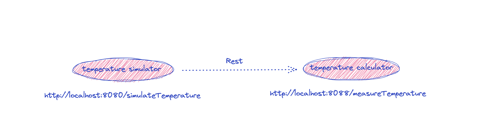
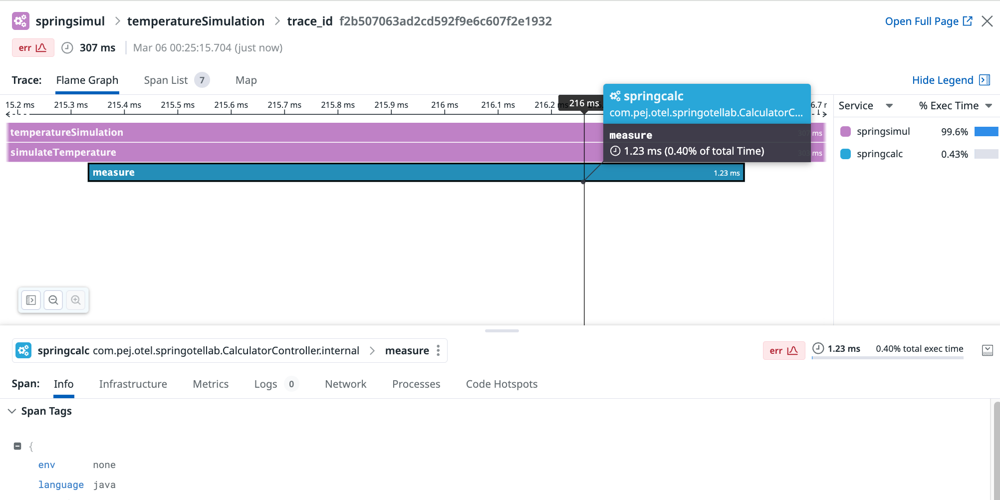

# Manual tracing: How to propagate context across services.


## Goal of this activity

In this section of the OpenTelemetry tutorial, we delve into the crucial aspect of context propagation across service boundaries, specifically focusing on interactions via REST calls using the OpenTelemetry Java SDK. Context propagation is fundamental in distributed tracing as it ensures that trace context is maintained when moving from one service to another. This continuity allows us to trace requests through various microservices in a system, providing a comprehensive view of a transaction or workflow.

We will cover the following key areas:

1. **Introduction to Context Propagation**: Begin with an overview of what context propagation is and why it's essential for distributed tracing in microservices architectures. This includes explaining the concepts of traces and spans, and how context is used to link spans across service boundaries.

2. **OpenTelemetry Context and Propagators**: Introduce the OpenTelemetry constructs for context and propagation. Explain how the `Context` object carries data, including trace information, across process boundaries, and how `Propagators` are used to inject and extract context from carrier formats (such as HTTP headers).

3. **Configuring the Propagation Mechanisms**: Detail the steps to configure the default or custom context propagation mechanisms in the OpenTelemetry Java SDK. This will involve setting up the `TextMapPropagator` for HTTP headers, which is commonly used for REST calls.

4. **Instrumenting a REST Call**: Provide a step-by-step guide on instrumenting a REST call from one service to another. This includes how to:
   - Use the OpenTelemetry API to create a new span for the outgoing request.
   - Inject the current context into the HTTP headers of the outgoing request.
   - Extract the context from the incoming request headers in the called service.
   - Create a new span in the called service as a child of the extracted span context.

5. **Example Implementation**: Offer a concise example implementation of two microservices interacting over HTTP, where service A calls service B. Include code snippets showing how to instrument the REST client in service A and the server in service B using OpenTelemetry Java SDK.

6. **Best Practices for Context Propagation**: Conclude with a discussion on best practices to ensure robust and efficient context propagation. Highlight the importance of consistent propagation techniques across services and the potential pitfalls to avoid.

By the end of this section, readers will have a solid understanding of how to implement context propagation using the OpenTelemetry Java SDK for services communicating over REST calls. This knowledge will enable them to trace requests seamlessly across service boundaries, improving observability and aiding in debugging and monitoring distributed systems.


## Overview of the set-up

We are going to transition from a single Spring Boot application that performs temperature measurements to two distinct services, namely a `Temperature Simulator` and a `Temperature Calculator`. Below is an explanation of the changes made and the rationale behind them:


### Original Architecture: Monolithic Application

Initially, the application was a monolith, where both the simulation of temperature measurements and the calculation of these measurements were handled within a single Spring Boot application. This setup included a `Thermometer` class responsible for generating simulated temperature values and possibly performing calculations directly within the same service.

### Transition to Microservices: Temperature Simulator and Temperature Calculator

The transformation involves splitting the original monolithic application into two microservices:


<p align="left">
  
</p>


1. **Temperature Simulator**: This service is responsible for simulating temperature measurements. It acts as the entry point for requests, simulating the generation of temperature data. However, instead of calculating the temperature values directly, it delegates the responsibility of performing calculations to the Temperature Calculator service.

    - **Key Changes**:
        - The Temperature Simulator retains the functionality to initiate temperature measurement simulations but now includes the capability to make HTTP requests to the Temperature Calculator for any required calculations.
        - It uses `RestTemplate` to call the Temperature Calculator service, passing necessary data through HTTP requests.
        - Tracing is incorporated to ensure that requests between the Temperature Simulator and the Temperature Calculator are part of the same trace for observability.

2. **Temperature Calculator**: This new microservice is solely responsible for performing calculations related to temperature. It exposes endpoints that the Temperature Simulator can call to retrieve calculated temperature values.

    - **Key Changes**:
        - A new Spring Boot application is created to serve as the Temperature Calculator.
        - It defines endpoints (e.g., `/measureTemperature`) that accept requests for temperature calculations, processes them, and returns the results.
        - OpenTelemetry tracing is integrated to extract the tracing context from incoming requests, ensuring that the distributed tracing spans across both the simulator and calculator services.

### Goal of this activity

- **Context Propagation**: To maintain observability across distributed microservices, the OpenTelemetry framework is used to propagate tracing context between the Temperature Simulator and the Temperature Calculator. This ensures that calls between services are linked within the same trace.
- **Service Communication**: The Temperature Simulator service uses HTTP clients (`RestTemplate`) to communicate with the Temperature Calculator, passing necessary information for calculations.


## Directory structure of the project

<pre style="font-size: 12px">

[root@pt-instance-1:~/oteljavalab/section06/activity]$ tree
.
├── build.gradle.kts
├── gradle
│   └── wrapper
│       ├── gradle-wrapper.jar
│       └── gradle-wrapper.properties
├── gradlew
├── settings.gradle.kts
├── startServices.sh
├── stopServices.sh
├── temperature-calculator
│   ├── build.gradle.kts
│   ├── gradle
│   │   └── wrapper
│   │       ├── gradle-wrapper.jar
│   │       └── gradle-wrapper.properties
│   ├── gradlew
│   ├── settings.gradle.kts
│   └── src
│       └── main
│           ├── java
│           │   └── com
│           │       └── pej
│           │           └── otel
│           │               └── springotellab
│           │                   ├── CalculatorApplication.java
│           │                   ├── CalculatorController.java
│           │                   └── Thermometer.java
│           └── resources
│               └── application.properties
└── temperature-simulator
    ├── build.gradle.kts
    ├── gradle
    │   └── wrapper
    │       ├── gradle-wrapper.jar
    │       └── gradle-wrapper.properties
    ├── gradlew
    ├── settings.gradle.kts
    └── src
        └── main
            ├── java
            │   └── com
            │       └── pej
            │           └── otel
            │               └── springotellab
            │                   ├── TemperatureApplication.java
            │                   ├── TemperatureController.java
            │                   └── Thermometer.java
            └── resources
                └── application.properties

72 directories, 43 files

</pre>


## Instrumenting our services


### Adding the SDK to the `temperature simulator` project


In order to makes sure that our dependancies are all aligned on the same version we will add that snippet right after the `plugin` block of the `build.gradle.kts` file


```java
configurations.all {
	resolutionStrategy.eachDependency {
		if (requested.group == "io.opentelemetry" && requested.name !in listOf("opentelemetry-semconv","opentelemetry-api-events", "opentelemetry-extension-incubator")) {
			useVersion("1.35.0")

		}
	}
}
```


In order to do so, we will simply add the following dependencies to the dependency bloc of the `build.gradle.kts` file for both services

This should look like

```java
dependencies {
        compile("org.springframework.boot:spring-boot-starter-web")
        implementation("io.opentelemetry:opentelemetry-api")
	    implementation("io.opentelemetry:opentelemetry-sdk")
	    implementation("io.opentelemetry:opentelemetry-exporter-logging")
	    implementation("io.opentelemetry.semconv:opentelemetry-semconv:1.23.1-alpha")
	    implementation("io.opentelemetry:opentelemetry-exporter-otlp:1.35.0")

}
```


Lastly we will give a different name for the artifact that will be produced for each of the two services by adding the following entries

In the `temperature simulator` build.gradle.kts file:

```java
tasks {
	bootJar {
		archiveFileName.set("springtempsimu-0.0.1-SNAPSHOT.jar")
	}
}
```


### Initializing the SDK in the `temperature simulator` project


In the TemperatureApplication.java class adding the SDK initialization block

```java

@Bean
    public OpenTelemetry openTelemetry(){

        Resource resource = Resource.getDefault().toBuilder().put(ResourceAttributes.SERVICE_NAME, "springsimul").build();

        OtlpGrpcSpanExporter otlpGrpcSpanExporter = OtlpGrpcSpanExporter.builder().setTimeout(2, TimeUnit.SECONDS).build();

        SdkTracerProvider setTracerProvider = SdkTracerProvider.builder()
                .addSpanProcessor(BatchSpanProcessor.builder(otlpGrpcSpanExporter).setScheduleDelay(100, TimeUnit.MILLISECONDS).build())
                .setResource(resource)
                .build();

        return OpenTelemetrySdk.builder().setTracerProvider(setTracerProvider).setPropagators(ContextPropagators.create(W3CTraceContextPropagator.getInstance())).buildAndRegisterGlobal();

    }

```

Also making sure that these packages are present or manually adding them in the import section, if not imported automatically by the IDE.

```java
import io.opentelemetry.api.OpenTelemetry;
import io.opentelemetry.api.trace.propagation.W3CTraceContextPropagator;
import io.opentelemetry.context.propagation.ContextPropagators;
import io.opentelemetry.exporter.otlp.trace.OtlpGrpcSpanExporter;
import io.opentelemetry.sdk.OpenTelemetrySdk;
import io.opentelemetry.sdk.resources.Resource;
import io.opentelemetry.sdk.trace.SdkTracerProvider;
import io.opentelemetry.sdk.trace.export.BatchSpanProcessor;
import io.opentelemetry.semconv.ResourceAttributes;
```


### Importance of setting Propagators


The line `setPropagators(ContextPropagators.create(W3CTraceContextPropagator.getInstance()))` in the OpenTelemetry SDK initialization code above is crucial for ensuring that the tracing context can be propagated across service boundaries in a distributed system. In the previous sections, we omitted the propagators configuration as weren't in need of dealing with context propagation. 

This setting configures the OpenTelemetry SDK to use the W3C Trace Context propagation format, which is a standard for transmitting trace context between services.

 
1. **Context Propagation**: The primary role of setting propagators in the OpenTelemetry SDK is to enable context propagation. Context propagation is the mechanism that allows trace information to be carried across process, network, and security boundaries. It ensures that traces are continuous across services and that spans from different services can be linked together into a single trace.

2. **Interoperability**: Using `W3CTraceContextPropagator.getInstance()` specifies that the SDK should use the W3C Trace Context standard for propagation. This standard is widely adopted and supported across many tracing systems and languages. By adhering to this standard, you ensure interoperability between different systems and components within your distributed architecture, even if they use different tracing tools or technologies.

3. **Tracing Headers**: The W3C Trace Context standard defines specific HTTP headers (`traceparent` and optionally `tracestate`) that carry the trace context information. When `W3CTraceContextPropagator` is used, the OpenTelemetry SDK automatically handles these headers to extract and inject trace context in HTTP requests and responses.


### Consequences of Not Setting Propagators

If you do not specify `setPropagators(ContextPropagators.create(W3CTraceContextPropagator.getInstance()))`, the OpenTelemetry SDK will not have a default propagator set for handling the context propagation. This means:

- **Failed Context Injection/Extraction**: When attempting to use `GlobalOpenTelemetry.getPropagators().getTextMapPropagator().inject(...)` or `.extract(...)`, these operations will not perform as expected because there is no propagator configured to handle the context propagation. This results in traces not being linked across service calls, leading to fragmented and incomplete traces.

- **Null or No-Op Behavior**: Without a configured propagator, calls to inject or extract the tracing context will effectively do nothing, leading to missing trace context in inter-service communications. This is why a "null object" behavior in the `Thermometer` class might be observed when attempting to use context propagation functions.


Configuring the propagators with `W3CTraceContextPropagator` is essential for distributed tracing to work correctly in applications that use OpenTelemetry for instrumentation. It enables trace context to be passed seamlessly across HTTP requests/responses, ensuring that distributed traces are complete and coherent, providing full visibility into the end-to-end request flow across microservices or distributed components.


### Instantiate a tracer


Now in `TemperatureController` we will need to get a hold on the `OpenTelemetry` object so that we can create a tracer instance. For this we need to add the following lines immediately after the Logger instance declaration:

```java

    private final Tracer tracer;


    @Autowired
    TemperatureController(OpenTelemetry openTelemetry) {
       tracer = openTelemetry.getTracer(TemperatureController.class.getName(), "0.1.0");
    }
```

Declaring the tracer variable and using constructor injection to initialize the tracer. The OpenTelemetry object provides a getTracer() method that allows this. 


The corresponding packages to import are:

```java
import io.opentelemetry.api.OpenTelemetry;
import io.opentelemetry.api.trace.Tracer;
```


### Creating a span in the Controller class

It's time now to build and start spans in the `TemperatureController` class. And we can replicate the same steps in anay other classes that contains methods we need to instrument.


Now that we can access the `Tracer` instance, let's add the tracing idioms in our code:
We will change the method implementation as follows:

Example with the `index()` method:

**_Before_**

```java
        if (measurements.isEmpty()) {
            throw new ResponseStatusException(HttpStatus.BAD_REQUEST, "Missing measurements parameter", null);
        }

        thermometer.setTemp(20, 35);
        List<Integer> result = thermometer.simulateTemperature(measurements.get());

        if (location.isPresent()) {
            logger.info("Temperature simulation for {}: {}", location.get(), result);
        } else {
            logger.info("Temperature simulation for an unspecified location: {}", result);
        }
        return result;
```

**_After_**

```java
        Span span = tracer.spanBuilder("temperatureSimulation").startSpan();
        try (Scope scope = span.makeCurrent()) {

            if (measurements.isEmpty()) {
                throw new ResponseStatusException(HttpStatus.BAD_REQUEST, "Missing measurements parameter", null);
            }

            thermometer.setTemp(20, 35);
            List<Integer> result = thermometer.simulateTemperature(measurements.get());

            if (location.isPresent()) {
                logger.info("Temperature simulation for {}: {}", location.get(), result);
            } else {
                logger.info("Temperature simulation for an unspecified location: {}", result);
            }
            return result;
        } catch(Throwable t) {
            span.recordException(t);
            throw t;
        } finally {
            span.end();
        }
    
```

**Note**: At this point, you will also need to consider importing the various classes manually that are needed if you use a Text editor.
This is generally handled _automatically_ by IDEs (IntelliJ or Eclipse).
If you have to do it manually, add the following to the import section of your `TemperatureController` class

```java
import io.opentelemetry.api.OpenTelemetry;
import io.opentelemetry.api.trace.Span;
import io.opentelemetry.api.trace.Tracer;
import io.opentelemetry.context.Scope;
```


### Context propagation


The `temperature simulator` service issues requests to the `temperature calculator` using RestTemplate, we will have to propagate the context by passing it through the call. This can be done as follows in the `Thermometer` class.

We also need to gain access to the Tracer as above by adding these instructions in the Thermometer class

```java

    private final Tracer tracer;


    @Autowired
    TemperatureController(OpenTelemetry openTelemetry) {
       tracer = openTelemetry.getTracer(Thermometer.class.getName(), "0.1.0");
    }
```


In the `simulateTemperature` method definition. We perform the following changes:

```java
    public List<Integer> simulateTemperature(int measurements) {
        List<Integer> temperatures = new ArrayList<Integer>();
        Span parentSpan = tracer.spanBuilder("simulateTemperature").startSpan();

        try (Scope scope = parentSpan.makeCurrent()) {
            for (int i = 0; i < measurements; i++) {
                HttpHeaders headers = new HttpHeaders();
                TextMapSetter<HttpHeaders> setter = HttpHeaders::set;
                GlobalOpenTelemetry.getPropagators().getTextMapPropagator().inject(Context.current(), headers, setter);
                HttpEntity<String> entity = new HttpEntity<>(headers);
                ResponseEntity<Integer> response = restTemplate.exchange(url, HttpMethod.GET, entity, Integer.class);
                temperatures.add(response.getBody());
            }
            return temperatures;
        } finally {
            parentSpan.end();
        }
    }
```


Let's break down what's happening in this method:

1. **Method Definition**:
   - The method `simulateTemperature(int measurements)` takes an integer `measurements` as its parameter, which specifies how many temperature measurements to simulate.

2. **Initialize Temperature List**:
   - A `List<Integer>` named `temperatures` is initialized to store the temperature values retrieved from the remote service.

3. **Start a New Span**:
   - A new tracing span is started using the OpenTelemetry API, named "simulateTemperature". This span represents the operation of simulating temperature measurements in the application's trace data.

4. **Span Scope**:
   - The span is made the current active span with `try (Scope scope = parentSpan.makeCurrent())`. This allows the OpenTelemetry SDK to recognize any nested operations or child spans as part of this parent span's trace.

5. **Simulate Measurements**:
   - A for loop iterates `measurements` times, simulating multiple temperature measurements.
   - For each iteration, it prepares an `HttpHeaders` object to carry the tracing context as HTTP headers. This is crucial for distributed tracing, allowing the trace to span across multiple services by propagating trace context through HTTP requests.
   - The `TextMapSetter` is a functional interface used by OpenTelemetry to inject the current tracing context into the HTTP headers.
   - The `GlobalOpenTelemetry.getPropagators().getTextMapPropagator().inject(Context.current(), headers, setter)` call injects the current trace context into the `headers`, enabling downstream services to continue the trace.
   - An `HttpEntity` is created with these headers, which will be used to make the HTTP GET request.
   - The `restTemplate.exchange` method is called with the service URL, HTTP method (`GET`), the `HttpEntity` containing headers with trace context, and the response type (`Integer.class`). This executes the HTTP request to the remote service that calculates a temperature measurement.
   - The response body, presumably a temperature measurement, is added to the `temperatures` list.

6. **Return Temperatures**:
   - Once all measurements are simulated, the list of temperatures is returned.

7. **End Span**:
   - Finally, outside the try block but within the finally block, the parent span is ended with `parentSpan.end()`. This marks the completion of the "simulateTemperature" operation in the trace.


### Adding the SDK to the `temperature calculator` project

The first steps of the instrumentation will be similar to what we have done so far with the `temperature simulator` service:

1. Updating the `build.gradle.sdk` file. We will simply name the artifact differently 

```java
tasks {
	bootJar {
		archiveFileName.set("springtempcalc-0.0.1-SNAPSHOT.jar")
	}
}
```


2. Initializing the OpenTelemetry SDK with the propagator as we did above
3. Modifying the `CalculatorController` class by injecting the OpenTelemetry object and acquiring a Tracer instance
4. Modifying the  `CalculatorController` class to use a TextMapGetter 

```java

    private static final TextMapGetter<HttpServletRequest> getter = new TextMapGetter<>() {
        @Override
        public Iterable<String> keys(HttpServletRequest carrier) {
            return (Iterable<String>) carrier.getHeaderNames();
        }

        @Override
        public String get(HttpServletRequest carrier, String key) {
            return carrier.getHeader(key);
        }
    };
```


This implementation is crucial for extracting trace context from incoming HTTP requests within the OpenTelemetry framework. Let's break down its components and understand its significance:

#### Purpose of `TextMapGetter<HttpServletRequest>`

OpenTelemetry's context propagation relies on the `TextMapGetter` and `TextMapSetter` interfaces to abstract away the details of how context is injected into and extracted from carrier objects. In this case, the carrier object is an `HttpServletRequest`, which represents an incoming HTTP request in a web application.

- **keys(HttpServletRequest carrier)**: This method is designed to return all the keys (header names, in this context) from the `HttpServletRequest`. These keys are used by the OpenTelemetry SDK to iterate over all headers and extract those relevant for tracing (like `traceparent` for W3C Trace Context). 

- **get(HttpServletRequest carrier, String key)**: Given a key (header name), this method retrieves the corresponding header value from the `HttpServletRequest`. This is used by the OpenTelemetry SDK to fetch specific headers that contain trace context information.

#### Usage

This `getter` object is used to extract trace context from incoming HTTP requests. When an HTTP request arrives at your service, the OpenTelemetry SDK utilizes this `getter` to read the trace context encoded in the request headers. This allows your service to continue the trace that was started by the caller, maintaining a cohesive trace across service boundaries.

#### Example of Context Extraction

When handling an incoming request, you would use this `getter` along with the global propagators to extract the trace context, like so:

```java
Context extractedContext = GlobalOpenTelemetry.getPropagators()
    .getTextMapPropagator()
    .extract(Context.current(), request, getter);
```

In this line, `extract` uses `getter` to scan the `HttpServletRequest`'s headers, looking for headers that represent the trace context (according to the configured propagation format, such as W3C Trace Context). The extracted context can then be used to create a new span as a child of the span from which the context was propagated, ensuring continuity in the distributed trace.


This implementation of `TextMapGetter<HttpServletRequest>` is an essential part of integrating OpenTelemetry's tracing capabilities into web applications where HTTP requests are the carriers of trace context. It abstracts the extraction of tracing information from HTTP headers, enabling seamless context propagation across microservices or distributed components within an application.


5. In the `CalculatorController` class, we change the implementation of the `measure` 

```java
@GetMapping("/measureTemperature")
    public int measure(HttpServletRequest request) {
        // Extract the context
        Context context = GlobalOpenTelemetry.getPropagators().getTextMapPropagator()
                .extract(Context.current(), request, getter);

        // Start a new span as a child of the extracted context
        Span span = tracer.spanBuilder("measure")
                .setParent(context)
                .startSpan();


        try (Scope scope = span.makeCurrent()) {
            // Your business logic here
            return thermometer.measureOnce();
        } finally {
            span.end(); // Make sure to end the span
        }
    }
```


The `measure` method annotated with `@GetMapping("/measureTemperature")` is a REST controller method designed to handle HTTP GET requests to the `/measureTemperature` endpoint. This method performs temperature measurement by invoking a downstream service or logic encapsulated within a `Thermometer` class. The method also integrates OpenTelemetry tracing to monitor and trace the execution of this temperature measurement operation. Here's a detailed breakdown of what happens inside this method:


1. **Context Extraction**:
   - `GlobalOpenTelemetry.getPropagators().getTextMapPropagator().extract(Context.current(), request, getter);`
   - This line extracts the tracing context from the incoming HTTP request. It uses a global propagator configured for your application and a custom `TextMapGetter` named `getter` that knows how to read headers from an `HttpServletRequest`.
   - The extracted context represents the parent tracing information, which may have been propagated from another service that called this endpoint.


2. **Span Creation**:
   - `tracer.spanBuilder("measure").setParent(context).startSpan();`
   - A new span named "measure" is created and configured to be a child of the extracted context. This means the operation tracked by this span (measuring temperature) is considered part of the larger trace that includes the caller's operations.
   - Starting the span signals the beginning of the temperature measurement operation from a tracing perspective.


3. **Business Logic Execution**:
   - The business logic, in this case, is encapsulated by the `thermometer.measureOnce()` method call. This method is expected to perform the actual temperature measurement.
   - Before executing the business logic, the method sets the newly created span as the current active span with `try (Scope scope = span.makeCurrent())`. This allows any further spans created within this scope to be automatically parented to this span, maintaining a proper hierarchy.
   - The result of `thermometer.measureOnce()` is directly returned to the caller of this endpoint.


4. **Span Closure**:
   - Finally, the span is ended with `span.end()` in the `finally` block. This marks the completion of the "measure" operation in the trace, regardless of the outcome (success or exception) of the business logic.
   - Ending the span ensures that it gets reported to your tracing backend, where it can be visualized and analyzed along with other spans in the trace.


## Build, run and test the application

<pre style="font-size: 12px">
[root@pt-instance-1:~/oteljavalab/section06/solution]$ gradle build

> Task :temperature-calculator:compileJava

BUILD SUCCESSFUL in 6s
8 actionable tasks: 8 executed

[root@pt-instance-1:~/oteljavalab/section06/solution]$ ./startServices.sh
Starting temperature-calculator service...
Starting temperature-simulator service...
Services are starting in the background. Logs are available in temperature-calculator.log and temperature-simulator.log

</pre>

Generate a request from another terminal using curl (or from a browser or postman)

<pre style="font-size: 12px">

[root@pt-instance-1:~/oteljavalab/section03/activity]$ curl "localhost:8080/simulateTemperature?measurements=5&location=Paris"

[21,28,29,35,27]
</pre>


## Check the results in the Datadog UI (APM traces)

<p align="left">
  
</p>


The generated flamegraph depicts the behavior we were aiming at obtaining. We can now see our two services stitched together inside the same trace. This results from the context propagation that was implemented throughout this section.       


To view the generated traces: https://app.datadoghq.com/apm/traces


## End

