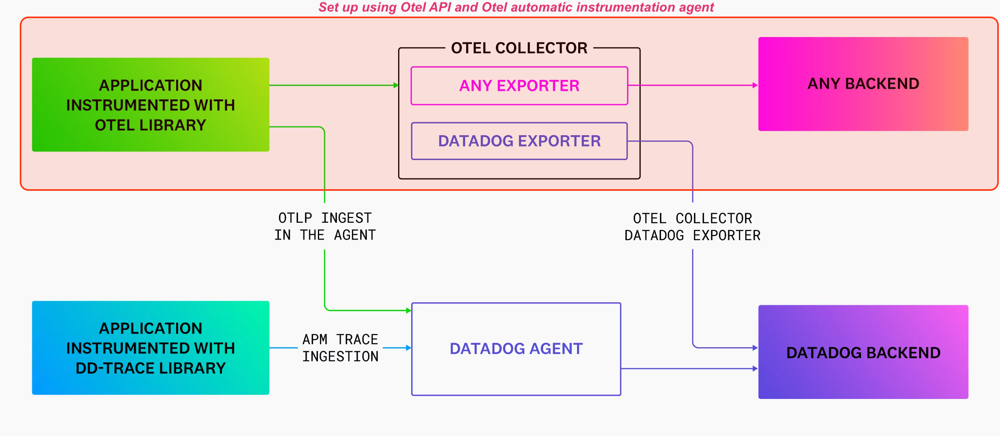
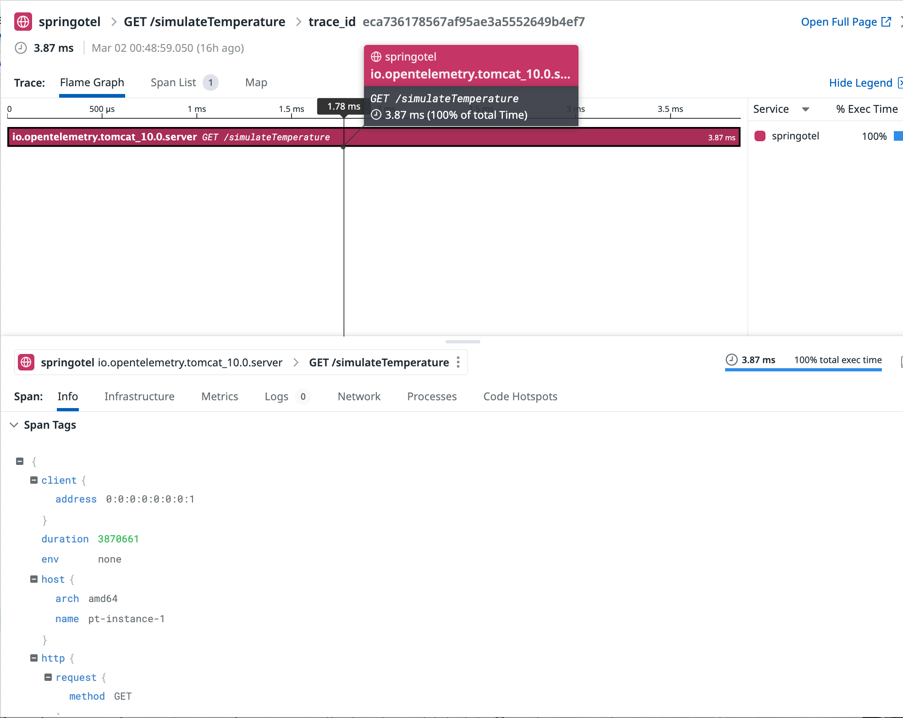
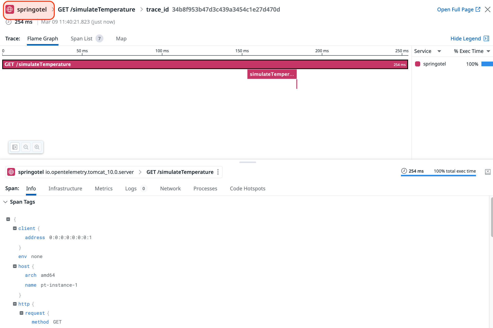

# Manual tracing: Otel API and the Otel java agent


## Goal of this activity

Combining the OpenTelemetry (Otel) java agent with the Otel API enables automatic instrumentation of java applications for distributed tracing, while also offering the flexibility to manually enrich traces with additional information. The Otel Java agent automatically instruments well-known frameworks and libraries to capture traces and metrics without the need for code modification. However, there may be instances where automatic instrumentation does not sufficiently detect or identify specific areas of the application code. In such cases, using the Otel API in conjunction with the java agent can help overcome these instrumentation limitations by allowing the addition of custom spans, attributes, or events.


## Architecture overview

<p align="left">
  
</p>


## Main steps

* Using the API and adding the necessary dependency to the project 
* Gaining access to a `Tracer` instance
* Create any additional span to the ones the java agent is creating  


## Adding the Otel API to the project

1. Accessing the container first

<pre style="font-size: 12px">
[root@pt-instance-1:~/oteljavalab]$ docker exec -it springotel bash
[root@pt-instance-1:/oteljavalab]$ 
</pre>


2. Navigating to the project directory.

<pre style="font-size: 12px">
[root@pt-instance-1:/oteljavalab]$ cd section07/activity
[root@pt-instance-1:/oteljavalab/section07/activity]$
</pre>


3. Download the Otel java agent

<pre style="font-size: 12px">
[root@pt-instance-1:/oteljavalab]$ cd section07/activity
[root@pt-instance-1:/oteljavalab/section07/activity]$ wget https://github.com/open-telemetry/opentelemetry-java-instrumentation/releases/latest/download/opentelemetry-javaagent.jar
</pre>


## Directory structure of the project

<pre style="font-size: 12px">

[root@pt-instance-1:/oteljavalab/section07/activity]$ tree
.
├── build.gradle.kts
├── gradle
│   └── wrapper
│       ├── gradle-wrapper.jar
│       └── gradle-wrapper.properties
├── gradlew
├── opentelemetry-javaagent.jar
├── settings.gradle.kts
└── src
    └── main
        ├── java
        │   └── com
        │       └── pej
        │           └── otel
        │               └── springotellab
        │                   ├── TemperatureApplication.java
        │                   ├── TemperatureController.java
        │                   └── Thermometer.java
        └── resources
            └── application.properties

8 directories, 20 files
</pre>


Unlike what we did in the previous sections where we had to add the Otej java sdk to the project and configure it. In this scenario we will only add the Otel API. This all boils down to modifying the `build.gradle.kts` file as follows:


```java
dependencies {
        compile("org.springframework.boot:spring-boot-starter-web")
        implementation("io.opentelemetry:opentelemetry-api")
}
```


And to make sure that our dependencies (particularly the ones that come through transitive dependency) are all aligned on the same version we will add that snippet right after the `plugin` block of the `build.gradle.kts` file


```java
configurations.all {
	resolutionStrategy.eachDependency {
		if (requested.group == "io.opentelemetry" && requested.name !in listOf("opentelemetry-semconv","opentelemetry-api-events", "opentelemetry-extension-incubator")) {
			useVersion("1.35.0")

		}
	}
}
```

## Instantiate a tracer


Let's modify the `TemperatureApplication` class and declare the `Tracer` as a Bean by annotating the corresponding method using the `@Bean` annotation. 
This bean can later be accessed from the other classes by relying on Spring's dependency injection mechanisms (this happens by using the `@Autowired` annotation). 


We will actually refer to it later in the `Thermometer` class. 

Let's add now the following block in the `TemperatureApplication` class *after* the `main()` method:

```java
    @Bean
    public Tracer tracer(){
        return GlobalOpenTelemetry.getTracer(TemperatureApplication.class.getName(), "0.1.0");
    }
```

We also need to import these packages if they are not inferred by the IDE

```java
import io.opentelemetry.api.GlobalOpenTelemetry;
import io.opentelemetry.api.trace.Tracer;

```

Now in `Thermometer` class we will need to gain access to the `Tracer` object and create a tracer instance. For this we need to add the following lines immediately after the Logger instance declaration:

```java

    private final Tracer tracer;


    @Autowired
    TemperatureController(Tracer tracer) {
       this.tracer = tracer;
    }
```

Declaring the tracer variable and using constructor injection to initialize the tracer.


The corresponding package to import is:

```java
import io.opentelemetry.api.trace.Tracer;
```


## Creating additional span to the ones created by the java agent


When instrumenting the application with the java agent **only** the trace looks like the one below

<p align="left">
  
</p>

There is only one span that gets created but the other methods we might want to see aren't identified and no spans are generated. That's where custom instrumentation will help enriching the trace


As we can now access the `Tracer` instance, we will change the method implementation as follows:


We are custom instrumenting the methods that are inside the `Thermometer` class (`simulateTemperature()` and `measureOnce()`). Exactly like what we did in the previous section when using the sdk

#### Before: without instrumentation

```java

public List<Integer> simulateTemperature(int measurements) {
    List<Integer> temperatures = new ArrayList<Integer>();
    for (int i = 0; i < measurements; i++) {
        temperatures.add(this.measureOnce());
    }
    return temperatures;
}


private int measureOnce() {
    return ThreadLocalRandom.current().nextInt(this.minTemp, this.maxTemp + 1);
}


public void setTemp(int minTemp, int maxTemp){
        this.minTemp = minTemp;
        this.maxTemp = maxTemp;
}

```


#### After: with manual instrumentation

```java
private final Tracer tracer;

@Autowired
Thermometer(OpenTelemetry openTelemetry) {
   tracer = openTelemetry.getTracer(Thermometer.class.getName(), "0.1.0");
}

public List<Integer> simulateTemperature(int measurements) {
    List<Integer> temperatures = new ArrayList<Integer>();
    Span parentSpan = tracer.spanBuilder("simulateTemperature").startSpan();
    try (Scope scope = parentSpan.makeCurrent()){
        for (int i = 0; i < measurements; i++) {
            temperatures.add(this.measureOnce());
        }
        return temperatures;
    } finally {
        parentSpan.end();
    }
}


private int measureOnce() {
	Span childSpan = tracer.spanBuilder("measureOnce").startSpan();
	try {
       return ThreadLocalRandom.current().nextInt(this.minTemp, this.maxTemp + 1);
    } finally {
    	childSpan.end();
    }
}
```

We also need to add these packages:

```java
import io.opentelemetry.api.trace.Span;
import io.opentelemetry.context.Scope;
```


## Build, run and test the application


From within the container, change to the `section07/activity` directory and run the build task 
<pre style="font-size: 12px">
[root@pt-instance-1:/oteljavalab$ cd section07/activity
[root@pt-instance-1:/oteljavalab/section07/activity]$ gradle build

BUILD SUCCESSFUL in 4s
4 actionable tasks: 4 executed
</pre>


Now let's start the application

<pre style="font-size: 12px">

[root@pt-instance-1:~/oteljavalab/section07/activity]$ java -javaagent:opentelemetry-javaagent.jar -jar build/libs/springtotel-0.0.1-SNAPSHOT.jar 
OpenJDK 64-Bit Server VM warning: Sharing is only supported for boot loader classes because bootstrap classpath has been appended
[otel.javaagent 2024-03-09 10:20:23:649 +0000] [main] INFO io.opentelemetry.javaagent.tooling.VersionLogger - opentelemetry-javaagent - version: 2.1.0
2024-03-09T10:20:28.540Z  INFO 3359426 --- [           main] c.p.o.s.TemperatureApplication           : Starting TemperatureApplication v0.0.1-SNAPSHOT using Java 17.0.9 with PID 3359426 (/root/oteljavalab/section07/activity/build/libs/springtotel-0.0.1-SNAPSHOT.jar started by root in /root/oteljavalab/section07/activity)
2024-03-09T10:20:28.609Z  INFO 3359426 --- [           main] c.p.o.s.TemperatureApplication           : No active profile set, falling back to 1 default profile: "default"
[otel.javaagent 2024-03-09 10:20:29:654 +0000] [OkHttp http://localhost:4318/...] WARN io.opentelemetry.exporter.internal.http.HttpExporter - Failed to export logs. Server responded with HTTP status code 404. Error message: Unable to parse response body, HTTP status message: Not Found
2024-03-09T10:20:30.293Z  INFO 3359426 --- [           main] o.s.b.w.embedded.tomcat.TomcatWebServer  : Tomcat initialized with port 8080 (http)
2024-03-09T10:20:30.331Z  INFO 3359426 --- [           main] o.apache.catalina.core.StandardService   : Starting service [Tomcat]
2024-03-09T10:20:30.331Z  INFO 3359426 --- [           main] o.apache.catalina.core.StandardEngine    : Starting Servlet engine: [Apache Tomcat/10.1.18]
2024-03-09T10:20:30.404Z  INFO 3359426 --- [           main] o.a.c.c.C.[Tomcat].[localhost].[/]       : Initializing Spring embedded WebApplicationContext
2024-03-09T10:20:30.406Z  INFO 3359426 --- [           main] w.s.c.ServletWebServerApplicationContext : Root WebApplicationContext: initialization completed in 1660 ms
[otel.javaagent 2024-03-09 10:20:30:659 +0000] [OkHttp http://localhost:4318/...] WARN io.opentelemetry.exporter.internal.http.HttpExporter - Failed to export logs. Server responded with HTTP status code 404. Error message: Unable to parse response body, HTTP status message: Not Found
2024-03-09T10:20:31.229Z  INFO 3359426 --- [           main] o.s.b.w.embedded.tomcat.TomcatWebServer  : Tomcat started on port 8080 (http) with context path ''
2024-03-09T10:20:31.251Z  INFO 3359426 --- [           main] c.p.o.s.TemperatureApplication           : Started TemperatureApplication in 3.67 seconds (process running for 7.913)
[otel.javaagent 2024-03-09 10:20:31:662 +0000] [OkHttp http://localhost:4318/...] WARN io.opentelemetry.exporter.internal.http.HttpExporter - Failed to export logs. Server responded with HTTP status code 404. Error message: Unable to parse response body, HTTP status message: Not Found
2024-03-09T10:20:46.322Z  INFO 3359426 --- [nio-8080-exec-1] o.a.c.c.C.[Tomcat].[localhost].[/]       : Initializing Spring DispatcherServlet 'dispatcherServlet'
2024-03-09T10:20:46.323Z  INFO 3359426 --- [nio-8080-exec-1] o.s.web.servlet.DispatcherServlet        : Initializing Servlet 'dispatcherServlet'
2024-03-09T10:20:46.324Z  INFO 3359426 --- [nio-8080-exec-1] o.s.web.servlet.DispatcherServlet        : Completed initialization in 1 ms

</pre>


### Observations about the command executed

```sh
java -javaagent:opentelemetry-javaagent.jar -jar build/libs/springtotel-0.0.1-SNAPSHOT.jar
```

- `java`: This is the command to run a java application. It invokes the JVM and starts the application.

- `-javaagent:opentelemetry-javaagent.jar`: This option specifies that the JVM should load the OpenTelemetry java agent at startup. The java agent is responsible for automatically instrumenting the application to collect telemetry data such as metrics and traces. The agent does this by modifying bytecode at runtime to insert instrumentation code. `opentelemetry-javaagent.jar` is the path to the OpenTelemetry java agent JAR file. This path might need to be adjusted based on the actual location of the file.

- `-jar build/libs/springtotel-0.0.1-SNAPSHOT.jar`: This part of the command tells the JVM to run the application packaged as a JAR file. The `-jar` option is followed by the path to the JAR file, which in this case is `build/libs/springtotel-0.0.1-SNAPSHOT.jar`. This file is our Spring Boot application (as indicated by the naming convention), and the version of the application is `0.0.1-SNAPSHOT`, a common convention for indicating a development version in Maven and Gradle projects.

Here's a breakdown of what happens when you run this command:

1. **JVM Initialization**: The JVM starts and reads the command-line options.
2. **Java agent loading**: Before the main application starts, the JVM loads the OpenTelemetry java agent specified by the `-javaagent` option. The agent initializes and sets up the necessary instrumentation to monitor the application's behavior.
3. **Application startup**: The JVM loads the main class from the specified JAR file and starts the application. Thanks to the instrumentation added by the java agent, the application's operations (e.g., HTTP requests, database queries) are monitored automatically, and telemetry data is collected.
4. **Telemetry collection**: As the application runs, the OpenTelemetry java agent collects data about its performance and operations. This data can include metrics about JVM performance, traces of application requests, and more.
5. **Data export**: The collected telemetry data is exported to a telemetry backend or observability platform (such as Datadog, Prometheus, Jaeger, or Zipkin) if configured. This allows developers and operators to monitor the application's health and performance in real-time.

This setup is particularly useful for gaining insights into application performance and troubleshooting issues without needing to modify the application's source code for basic telemetry collection.


### Test the application

Generate a request from another terminal using curl (or from a browser or postman) either locally on the host or from the container 

<pre style="font-size: 12px">

[root@pt-instance-1:/oteljavalab/section07/activity]$ curl "localhost:8080/simulateTemperature?measurements=5&location=Paris"

[21,28,29,35,27]
</pre>


This will produce the following trace

<p align="left">
  
</p>


### Observations about the java agent configuration.


When examining the trace, you might have noticed that the service is actually named after the name of the artifact (`springtotel-0.0.1-snapshot`). Which is probably not what we would like to see in a production environment.

Thankfully this is something that can be changed through the java agent configuration

To specify a custom service name for the application when using the Otel java agent, you can set the `otel.service.name` property. This property allows you to define a meaningful and recognizable name for your service, which is particularly useful for distinguishing between different services in your telemetry data.

You can pass the `otel.service.name` as a system property directly in the command line that runs your application. This is done using the `-D` flag followed by the property name and value. Here's how you can modify the previous command to include a custom service name:

```sh
java -javaagent:opentelemetry-javaagent.jar -Dotel.service.name=springotel -jar build/libs/springtotel-0.0.1-SNAPSHOT.jar
```

In this command, `-Dotel.service.name=springotel` sets the service name to "springotel".


Additionally, here are a few more examples of system properties you might find useful:

1. **Exporter URL**: If you're using an OpenTelemetry Protocol (OTLP) exporter to send telemetry data to an observability backend, you can specify the endpoint:

    ```java
    -Dotel.exporter.otlp.endpoint=http://my-collector:4317
    ```

    This sets the OTLP exporter to send data to `http://my-collector:4317`.

2. **Resource attributes**: You can specify additional resource attributes, such as environment, to be attached to all spans and metrics:

    ```java
    -Dotel.resource.attributes=environment=production
    ```

    This adds a resource attribute indicating that the telemetry is coming from a production environment.

3. **Sampling rate**: To control the amount of telemetry data collected, you can adjust the sampling rate. For example, to sample 50% of traces:

    ```java
    -Dotel.traces.sampler=traceidratio -Dotel.traces.sampler.arg=0.5
    ```

    This configures the sampler to a trace ID ratio based sampling, collecting approximately 50% of traces.

The OpenTelemetry documentation and the agent's GitHub repository are good sources for more detailed information on available configuration options.


## Check the results in the Datadog UI (APM traces)

If we run the application by providing the service name and test it, we can see that the two methods are being instrumented and correlated with the previous span that was generated by the the java agent and correctly named after the desired service name (`springotel`)

<p align="left">
  
</p>


To view the generated traces: https://app.datadoghq.com/apm/traces

## End

