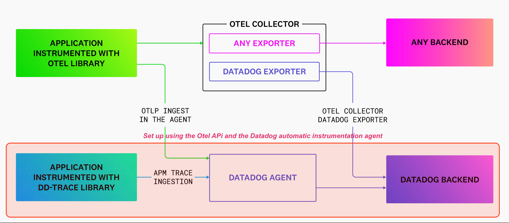
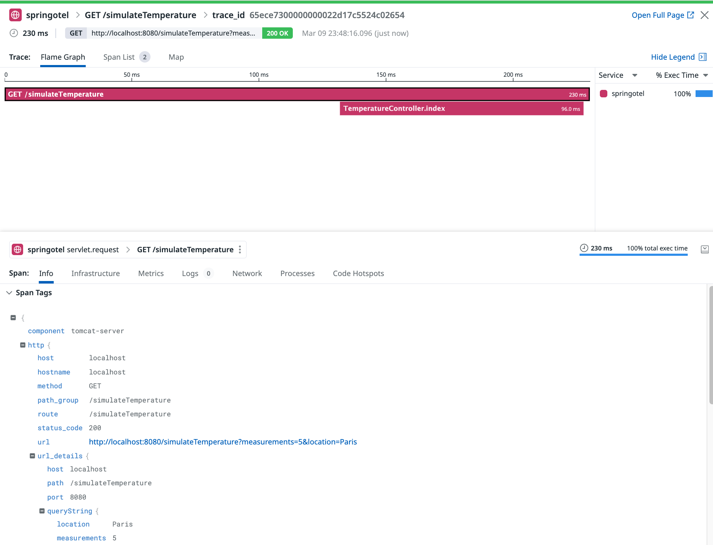
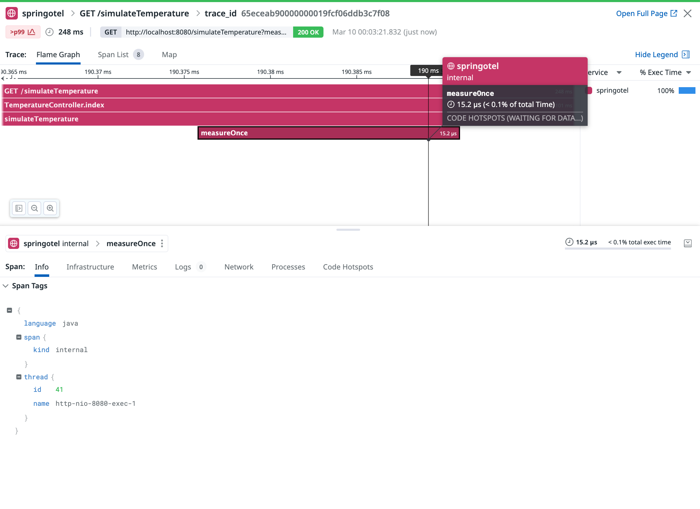
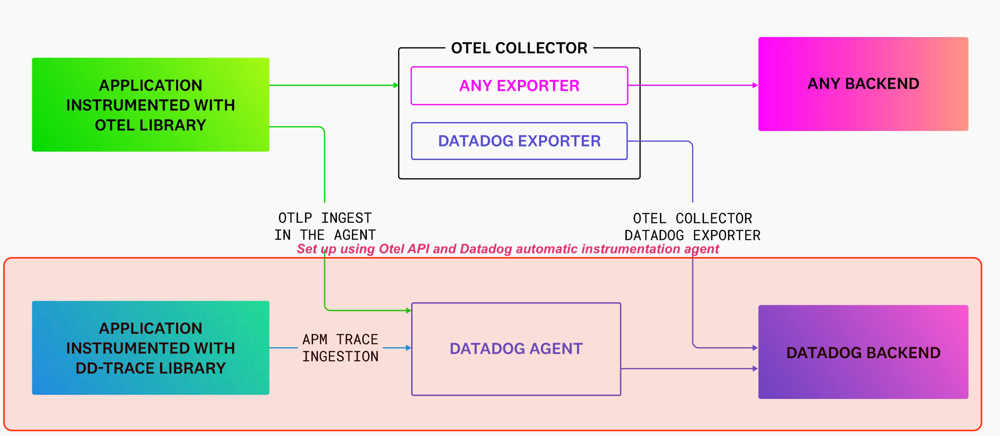
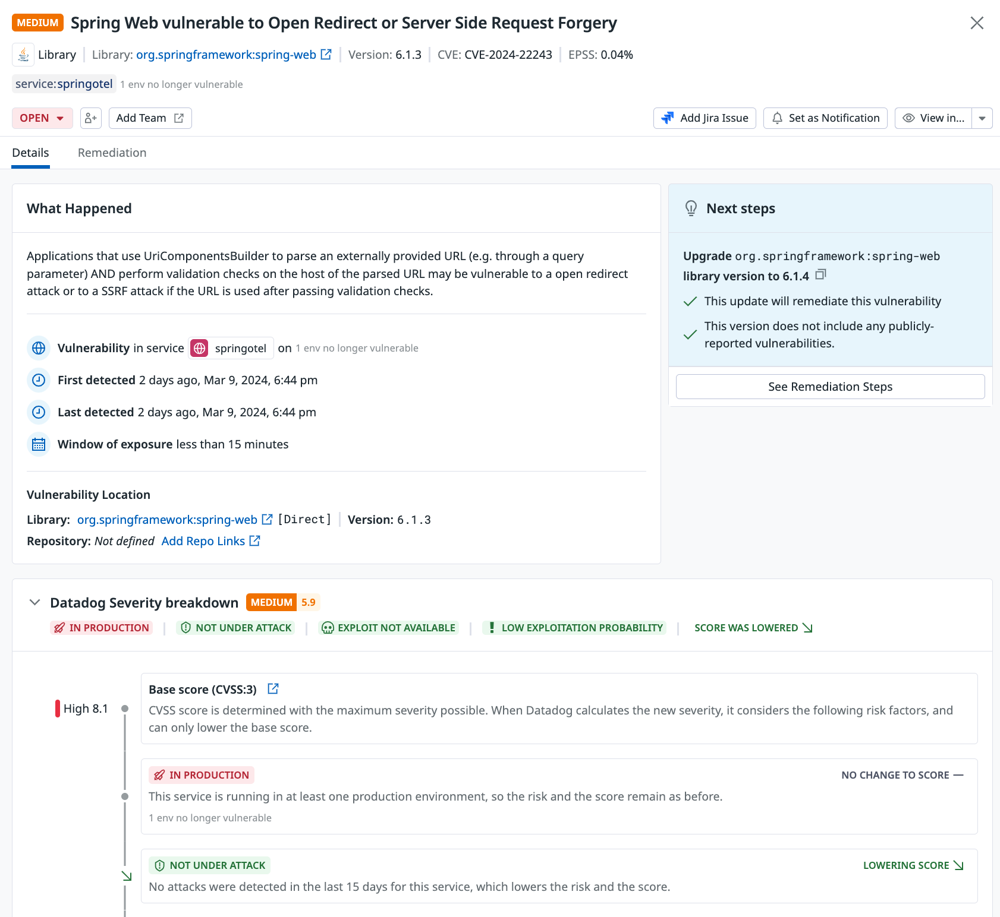

# Manual tracing: Otel API and the Datadog java agent


## Goal of this activity

This section will demonstrate how you can achieve the same objectives as the previous section, but this time by using the Datadog java agent. The main difference lies in the goals we aim to achieve. The benefit of using the Datadog agent is the ability to take advantage of features not yet available in the OpenTelemetry ecosystem, such as **continuous profiling**, **application security**, and **dynamic instrumentation**. 

These can be leveraged while still adding custom instrumentation using OpenTelemetry. The instructions regarding code modification remain unchanged; therefore, we won't repeat them here. Instead, we will focus on the specifics of enabling these capabilities with the Datadog agent. 


## Main steps

* Setting up the Datadog Agent
* Downloading the Datadog java agent.
* Custom instrumentation using the Otel API (cf previous section)
* Building, running and testing the app  


## Architecture overview

<p align="left">
  
</p>


## Setting up the Datadog Agent

A specific docker-compose file (`docker-compose-section08.yml`) is provided and contains the necessary settings to spin up the Datadog agent container configured to receive traces. And another service to start the application container containing our Spring application.  

### Setting up the environment


1. Bootsrap the containers by using the corresponding docker-compose file `docker-compose-section08.yml`
(Make sure the `DD_API_KEY` and `DD_SITE` env variables are set)   

```bash
[root@pt-instance-1:~/oteljavalab]$ DD_SITE="your_site_value" DD_API_KEY="your_api_key_value" docker-compose -f docker-compose-section08.yml up -d
Starting springotel           ... done
Starting dd-agent-dogfood-jmx ... done
```


2. Accessing the application container

<pre style="font-size: 12px">
[root@pt-instance-1:~/oteljavalab]$ docker exec -it springotel bash
[root@pt-instance-1:~/oteljavalab]$ 
</pre>


3. Navigating to the project directory.

<pre style="font-size: 12px">
[root@pt-instance-1:~/oteljavalab]$ cd section08/activity
[root@pt-instance-1:~/oteljavalab/section08/activity]$
</pre>


4. Download the Datadog java agent

<pre style="font-size: 12px">
[root@pt-instance-1:~/oteljavalab/section08/activity]$ wget -O dd-java-agent.jar 'https://dtdg.co/latest-java-tracer'
</pre>


## Instrumentation without the Otel API using the Datadog java agent.

For this we will simply run our application by passing the `-javaagent` pointing to the Datadog java agent as a JVM option.

<pre style="font-size: 12px">

[root@pt-instance-1:~/oteljavalab/section08/activity]$ java -javaagent:dd-java-agent.jar -Ddd.service=springotel -jar build/libs/springotel-0.0.1-SNAPSHOT.jar 
OpenJDK 64-Bit Server VM warning: Sharing is only supported for boot loader classes because bootstrap classpath has been appended
[dd.trace 2024-03-09 22:47:07:699 +0000] [dd-task-scheduler] INFO datadog.trace.agent.core.StatusLogger - DATADOG TRACER CONFIGURATION {"version":"1.31.1~37358b9aa1","os_name":"Linux","os_version":"6.5.0-1008-gcp","architecture":"amd64","lang":"jvm","lang_version":"17.0.9","jvm_vendor":"Eclipse Adoptium","jvm_version":"17.0.9+9","java_class_version":"61.0","http_nonProxyHosts":"null","http_proxyHost":"null","enabled":true,"service":"springotel","agent_url":"http://localhost:8126","agent_error":false,"debug":false,"trace_propagation_style_extract":["datadog","tracecontext"],"trace_propagation_style_inject":["datadog","tracecontext"],"analytics_enabled":false,"sampling_rules":[{},{}],"priority_sampling_enabled":true,"logs_correlation_enabled":true,"profiling_enabled":false,"remote_config_enabled":true,"debugger_enabled":false,"appsec_enabled":"ENABLED_INACTIVE","telemetry_enabled":true,"telemetry_dependency_collection_enabled":true,"telemetry_log_collection_enabled":false,"dd_version":"","health_checks_enabled":true,"configuration_file":"no config file present","runtime_id":"43d1f66d-f837-4e43-8e4d-bd7b095dbd96","logging_settings":{"levelInBrackets":false,"dateTimeFormat":"'[dd.trace 'yyyy-MM-dd HH:mm:ss:SSS Z']'","logFile":"System.err","configurationFile":"simplelogger.properties","showShortLogName":false,"showDateTime":true,"showLogName":true,"showThreadName":true,"defaultLogLevel":"INFO","warnLevelString":"WARN","embedException":false},"cws_enabled":false,"cws_tls_refresh":5000,"datadog_profiler_enabled":true,"datadog_profiler_safe":true,"datadog_profiler_enabled_overridden":false,"data_streams_enabled":false}
2024-03-09T22:47:09.069Z  INFO 424 --- [           main] c.p.o.s.TemperatureApplication           : Starting TemperatureApplication v0.0.1-SNAPSHOT using Java 17.0.9 with PID 424 (/oteljavalab/section08/activity/build/libs/springotel-0.0.1-SNAPSHOT.jar started by root in /oteljavalab/section08/activity)
2024-03-09T22:47:09.100Z  INFO 424 --- [           main] c.p.o.s.TemperatureApplication           : No active profile set, falling back to 1 default profile: "default"
2024-03-09T22:47:11.116Z  INFO 424 --- [           main] o.s.b.w.embedded.tomcat.TomcatWebServer  : Tomcat initialized with port 8080 (http)
2024-03-09T22:47:11.187Z  INFO 424 --- [           main] o.apache.catalina.core.StandardService   : Starting service [Tomcat]
2024-03-09T22:47:11.187Z  INFO 424 --- [           main] o.apache.catalina.core.StandardEngine    : Starting Servlet engine: [Apache Tomcat/10.1.18]
2024-03-09T22:47:11.254Z  INFO 424 --- [           main] o.a.c.c.C.[Tomcat].[localhost].[/]       : Initializing Spring embedded WebApplicationContext
2024-03-09T22:47:11.256Z  INFO 424 --- [           main] w.s.c.ServletWebServerApplicationContext : Root WebApplicationContext: initialization completed in 2025 ms
2024-03-09T22:47:11.846Z  INFO 424 --- [           main] o.s.b.w.embedded.tomcat.TomcatWebServer  : Tomcat started on port 8080 (http) with context path ''
2024-03-09T22:47:11.860Z  INFO 424 --- [           main] c.p.o.s.TemperatureApplication           : Started TemperatureApplication in 3.883 seconds (process running for 6.252)
</pre>


And then we can send a request and observe the result

<p align="left">
  
</p>


What we get is fairly comparable to the result obtained when using the OpenTelemetry java agent except that in the case of the Datadog agent we get two spans (One for the `servlet.request` operation and the second for the controller handler method `index()`). 

But like the Otel java agent, the Datadog java agent doesn't capture either the details associated to the `Thermometer` methods `simulateTemperature()` and `measureOnce()`.   

To get around this we will proceed as we did previously by adding the Otel API and instrument manually those methods.

## Manual instrumentation using the Otel API

Same instructions as the previous section that describes how to:

* Use the API and adding the necessary dependency to the project
* Gain access to the `Tracer` instance
* Create any additional span to the ones the java agent is creating


## Build, run and test the application

After having modified and rebuilt the application, let's run and test it again.
 
<pre style="font-size: 12px">

[root@pt-instance-1:~/oteljavalab/section08/activity]$ java -javaagent:dd-java-agent.jar -Ddd.service=springotel -Ddd.trace.otel.enabled=true -jar build/libs/springotel-0.0.1-SNAPSHOT.jar 
OpenJDK 64-Bit Server VM warning: Sharing is only supported for boot loader classes because bootstrap classpath has been appended
[dd.trace 2024-03-09 23:03:09:968 +0000] [dd-task-scheduler] INFO datadog.trace.agent.core.StatusLogger - DATADOG 
...
...
...
2024-03-09T23:03:13.656Z  INFO 3598988 --- [           main] o.s.b.w.embedded.tomcat.TomcatWebServer  : Tomcat started on port 8080 (http) with context path ''
2024-03-09T23:03:13.670Z  INFO 3598988 --- [           main] c.p.o.s.TemperatureApplication           : Started TemperatureApplication in 3.381 seconds (process running for 5.753)

</pre>


### Observations about the command executed

```bash
java -javaagent:dd-java-agent.jar -Ddd.service=springotel -Ddd.trace.otel.enabled=true -jar build/libs/springotel-0.0.1-SNAPSHOT.jar
```

- `java`: This invokes the JVM to start the java application.

- `-javaagent:dd-java-agent.jar`: This option specifies the Datadog java agent (`dd-java-agent.jar`) that should be attached to the JVM. The Datadog java agent provides automatic instrumentation for a wide range of java frameworks and libraries, enabling the collection of traces and metrics without modifying the application code.

- `-Ddd.service=springotel`: This system property (`-D`) sets the name of the service as `springotel`. In Datadog, service names are used to group related traces, logs and metrics, making it easier to navigate and monitor the application's performance.

- `-Ddd.trace.otel.enabled=true`: This option enables the OpenTelemetry interoperability within the Datadog java agent. By setting this property to `true`, we are allowing the Datadog agent to consume telemetry data (traces, metrics) using the OpenTelemetry protocol. This is particularly useful if transitioning from OpenTelemetry to Datadog or if using tools and libraries that are instrumented with OpenTelemetry.

- `-jar build/libs/springotel-0.0.1-SNAPSHOT.jar`: This part of the command specifies that the JVM should run the application packaged in the JAR file `build/libs/springotel-0.0.1-SNAPSHOT.jar`. This is the application's JAR, tied to our Spring Boot application.


### Test the application and check the results in the Datadog UI

Generate a request from another terminal using curl **from within the container** 

<pre style="font-size: 12px">

[root@pt-instance-1:~/oteljavalab/section08/activity]$ curl "localhost:8080/simulateTemperature?measurements=5&location=Paris"

[21,28,29,35,27]
</pre>


This will produce the following trace

<p align="left">
  
</p>

This demonstrates that the previously missing spans are now visible and correctly correlated with those generated by the automatic instrumentation.

To view the generated traces: https://app.datadoghq.com/apm/traces


## Why using the Datadog agent together with the Otel API?

As mentioned in the introduction of this section, the benefit of using the Datadog agent is the ability to take advantage of features not yet available in the OpenTelemetry ecosystem, such as **continuous profiling**, **application security**, and **dynamic instrumentation**. 


Here are a few examples of how this looks like:

### Continous profiling

Datadog continuous profiling is a feature part of Datadog's observability platform designed to help developers and operations teams understand and optimize the performance of their applications. It provides detailed insights into how code executes in production environments, enabling teams to identify and troubleshoot performance bottlenecks, reduce latency, and improve efficiency.

1. **Real-Time performance insights**: Datadog continuous profiling collects real-time performance data from applications, including CPU usage, memory allocation, socket I/O and other critical metrics. This data is collected continuously, providing an up-to-date view of application performance and helping teams quickly identify any anomalies or inefficiencies.

2. **Low overhead profiling**: One of the key benefits of continuous profiling is its low impact on application performance. Datadog profiling is designed to gather detailed performance data with minimal overhead, ensuring that the profiling process does not adversely affect the application's speed or user experience.

3. **Code-level visibility**: Continuous profiling provides insights down to the code level, allowing teams to see exactly which lines of code, methods, threads, classes or services are consuming the most resources. This granular view makes it easier to pinpoint the root causes of performance issues and understand the impact of specific code paths on overall application health.

4. **Cross-language support**: Continuous profiling supports a range of programming languages, making it ideal for use in diverse application environments. This includes popular languages such as Java, Go, Python, Node.js, and .NET, among others. Cross-language support ensures that teams can maintain a consistent profiling approach across their entire technology stack.

5. **Integration with APM and Logs**: Continuous profiling is integrated with Datadog APM, Infrastructure and log monitoring. This integration enables teams to correlate profiling data with metrics, traces and logs, providing a comprehensive view of application performance and behavior. By linking profiling data with specific requests or transactions, teams can more effectively diagnose issues and understand their impact on users.

6. **Actionable recommendations**: Beyond simply collecting and presenting data, Continuous profiling offers actionable recommendations to improve performance. The platform can suggest optimizations, highlight potential inefficiencies, and help teams prioritize performance improvements based on their potential impact.

7. **Cost optimization**: By identifying inefficient use of resources, continuous profiling can also help organizations optimize their cloud or infrastructure costs. Reducing unnecessary CPU or memory usage not only improves application performance but can also lead to significant cost savings.


Continuous profiling is not enabled by default. In order to do so you would need to set this system properties or environment variable equivalent:

<pre style="font-size: 12px">
[root@pt-instance-1:~/oteljavalab/section08/activity]$ java -javaagent:dd-java-agent.jar -Ddd.service=springotel -Ddd.trace.otel.enabled=true -Ddd.profiling.enabled=true -XX:FlightRecorderOptions=stackdepth=256 -jar build/libs/springotel-0.0.1-SNAPSHOT.jar
</pre>


1. **`-Ddd.profiling.enabled=true`**: This option enables continuous profiling. By setting this to `true`, the Datadog java agent will collect profiling data such as CPU usage, memory allocation, and more, which helps in identifying performance bottlenecks and optimizing application performance.

2. **`-XX:FlightRecorderOptions=stackdepth=256`**: This option configures the java filght recorder (JFR) or the async profiler, that are tools for collecting diagnostic and profiling data and events from a running java application. `stackdepth=256` sets the maximum stack depth for stack traces collected by JFR to 256. This is useful for detailed profiling information, especially when diagnosing performance issues.


When enabled, and if you let the system process requests, after a few minutes you should be able to get several profiles that gives a perspective of all the frames displayed when the application is running

<p align="left">
  
</p>

Here's how to interpret the given profile:

**Flamegraph Interpretation:**

- ***Color Coding***: Each color on the flame graph represents a different package or class, helping you quickly identify where CPU time is being spent by package.
- ***Width of Bars***: The width of each bar on the flame graph corresponds to the amount of CPU time consumed. Wider bars indicate more CPU time.
- ***Call Stack***: The vertical axis represents the call stack at each moment during the profiling session, with the bottom being the end of the call stack and the top being the root method call (e.g., the `Thread.run()` method)
- ***Top Consumers***: The `Thermometer` class's methods appears to be the top CPU consumer for the `/simulateTemperature` endpoint, taking up 410ms, which is 28% of the profiled CPU time.
- ***Endpoint Performance***: The `/simulateTemperature` endpoint has a CPU Time of 620ms, which represents the aggregate time across all invocations of this endpoint during the profiling period. This is an indication of the endpoint's performance impact.
- ***Other Activity***: Besides the `simulateTemperature` endpoint, there's "Other activity" taking up 1.61s of CPU time, which may be indicative of other operations happening within the application outside the specific endpoint.

### Application security and vulnerability assessment

Application Security Monitoring (ASM) and Vulnerability Assessment features are part of their larger suite of Datadog's security tools designed to provide real-time threat detection and visibility into the security posture of applications.

***Application Security Monitoring (ASM)***

Datadog ASM is designed to protect applications against runtime threats. It integrates with the tracing library and provides the following capabilities:

- **Real-time threat detection**: ASM monitors live application traffic to detect and alert on various threats, such as web attacks (SQL injection, cross-site scripting), security misconfigurations, and known bad actors. 
- **Runtime security**: It tracks the runtime behavior of applications, providing insights into potentially malicious activity such as command injections or unauthorized access attempts.
- **Monitoring and alerting**: Provides real-time alerts and detailed information about security events, allowing teams to investigate and respond quickly to incidents.

***Vulnerability Assessment***

Vulnerability Assessment focuses on identifying and managing software vulnerabilities within any application stack:

- **Dependency scanning**: It automatically scans applications and their dependencies for known vulnerabilities using package managers and software composition analysis (SCA) techniques.
- **Continuous monitoring**: Regularly checks for new vulnerabilities that may affect your application stack and alerts about any newly discovered issues.
- **Risk prioritization**: Helps prioritize remediation efforts by assessing the severity of detected vulnerabilities and their potential impact on the underlying environment.
- **Reporting and compliance**: Offers reports and dashboards that help track vulnerability management efforts and support compliance with various security standards.

Application security and vulnerability assessment are not enabled by default. In order to do so you would need to use the following system properties or equivalent environment variables:

<pre style="font-size: 12px">
[root@pt-instance-1:~/oteljavalab/section08/activity]$ java -javaagent:dd-java-agent.jar -Ddd.service=springotel -Ddd.trace.otel.enabled=true -Ddd.appsec.enabled=true -Ddd.iast.enabled=true -jar build/libs/springotel-0.0.1-SNAPSHOT.jar
</pre>


1. `-Ddd.appsec.enabled=true`: Enables application security monitoring. This means that the agent will collect data about the security context of the application and detect security-related events such as attempted attacks.

2. `-Ddd.iast.enabled=true`: Enables interactive application security testing (IAST), allowing the agent to analyze code for security vulnerabilities in real-time as the application is running.

When enabled, and if you let the system process requests, after a few minutes you should be able to get several security events that gives a perspective of all the potential threats/attacks or vulnerability patterns tied to the application

<p align="left">
  
</p>


This screenshot from the vulnerability assessment interface displays a security warning for a web application, specifically highlighting a vulnerability in the Spring Web framework.

Here's how that can be interpreted:

- **Vulnerability Title**: "Spring Web vulnerable to Open Redirect or Server Side Request Forgery (SSRF)"
   - This indicates that the application is using a version of the Spring web framework with known vulnerabilities that could allow open redirect and SSRF attacks.

- **Affected Library**: `org.springframework:spring-web` Version: `6.1.3`
   - The application is using version `6.1.3` of the `spring-web` library, which is known to contain the vulnerability.

- **CVE Reference**: `CVE-2024-22243`
   - The given CVE number associated with this specific security issue.

- **Detection Timeline**:
   - **First detected**: 2 days ago, indicating when the issue was initially discovered.
   - **Last detected**: 2 days ago, which is the same as the first detection in this case.
   - **Window of exposure**: less than 15 minutes, suggesting that the period during which the application was vulnerable was brief.

- **Datadog severity breakdown**:
   - **Severity**: Medium, with a score of 5.9. This is Datadog's severity rating based on their risk analysis.
   - **Base Score**: High 8.1, according to the CVSS v3, indicating a more serious level of risk.
   - **In Production**: The service is running in at least one production environment, maintaining the risk score.
   - **Not Under Attack**: No attacks have been detected recently for this service, which may be a factor in lowering the overall risk score.

- **Next Steps**: An upgrade to `spring-web` library version `6.1.4` is recommended to mitigate this vulnerability. This newer version presumably does not include the reported vulnerabilities.

## Tearing down the services

Exit the container

<pre style="font-size: 12px">
[root@pt-instance-1:~/oteljavalab/section08/activity]$ exit
[root@pt-instance-1:~/oteljavalab/section08/activity]$ 
</pre>

Graceful shutdown

<pre style="font-size: 12px">
[root@pt-instance-1:~/oteljavalab/section08/activity]$ docker-compose down
Stopping springotel           ... done
Stopping dd-agent-dogfood-jmx ... done
Removing springotel           ... done
Removing dd-agent-dogfood-jmx ... done
</pre>


## End

