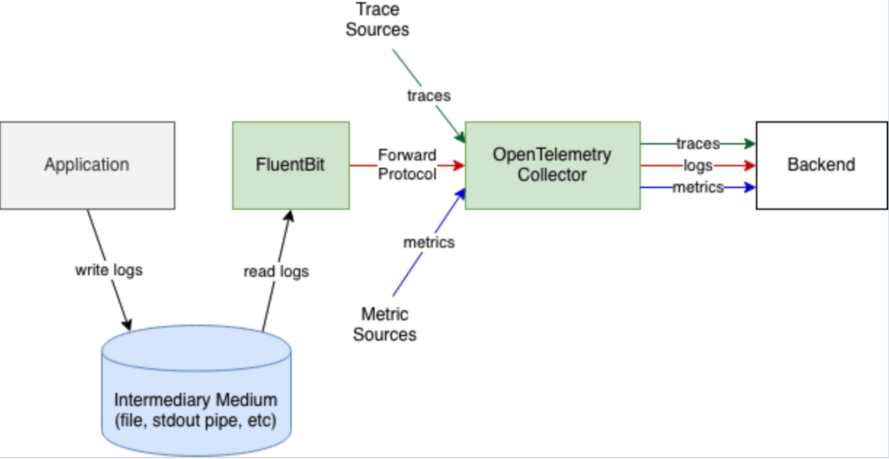
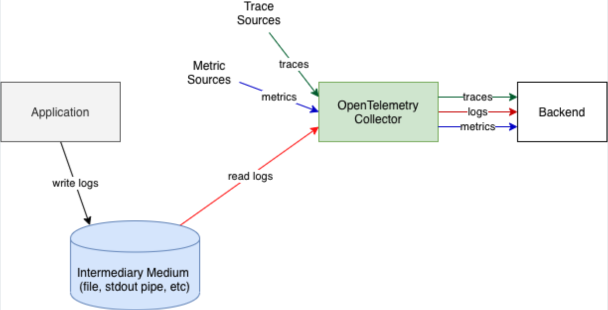
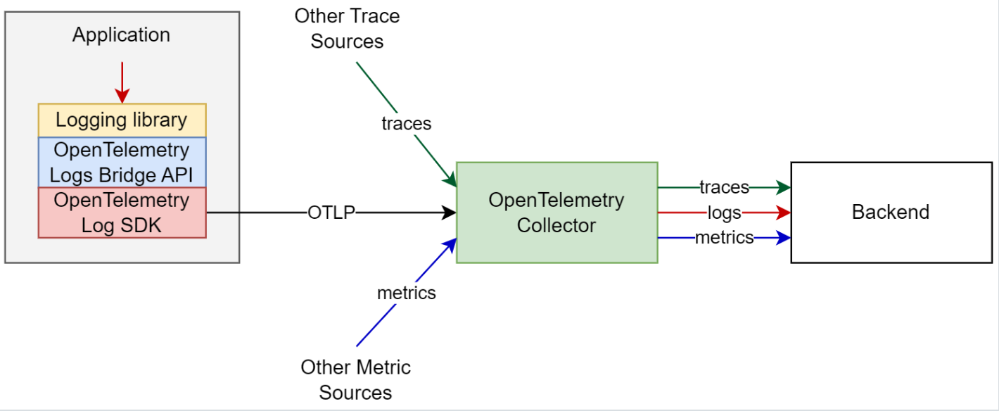

# Sending other Observability signals: Logs 


## Goal of this activity


In the previous sections, we discussed the fundamentals of tracing and the process of sending metrics to understand and monitor the performance of our applications. our next focus shifts to an equally important component: log management through OpenTelemetry.

Logs provide the detailed narrative of an application's operation, offering detailed insights into its behavior and interactions. While metrics and traces give us an overview and a deep dive into the performance issues, respectively, logs bring the granularity of textual data that can pinpoint exactly what happened and when. This level of detail is crucial for troubleshooting, security audits, and understanding the operational context of applications and systems.

OpenTelemetry extends its capabilities beyond tracing and metrics to address log management. This integration allows developers and operators to correlate logs with traces and metrics, creating a holistic view of their system's health and performance. By treating logs as a first-class citizen in the observability realm, OpenTelemetry facilitates a more nuanced and interconnected approach to monitoring.

This section of our lab will guide you through the essentials of log management in OpenTelemetry. 


## Main steps

In section 9, we explored how to send metrics. This section will not involve many changes regarding our code. We will reuse the same service from which we were collecting traces and metrics already. We will focus on the necessary steps to deal with log management. 

Here are some of the steps we will follow:

- Otel approach to send logs (Fluentbit, Filelog, Otel appender)
- Collector adjustements to enable filelog receiver 
- Collector adjustements to configure unified service tagging and ddsource (processor and pipelines)
- Adapting our Springboot service to generate log events to a file (Logback and MDC - implementation("io.opentelemetry.instrumentation:opentelemetry-logback-mdc-1.0:2.1.0-alpha")
- Configuring logback
- Backend: DD log pipelines and remapper


## Otel approaches to send logs 

Otel provides thtree strategies for sending logs from applications to the collector, each catering to different logging needs and architectures. Here's a brief description of them:

### 1. **Direct send from application to the collector using Fluent Bit**

In this strategy, logs are sent directly from the application to the OpenTelemetry Collector using Fluent Bit. Fluent Bit is a lightweight and highly efficient log processor and forwarder, which can be embedded in the application or run as a separate service. This approach is designed for real-time log processing and forwarding, minimizing latency and overhead by bypassing intermediary log files. It's particularly suitable for cloud-native applications that demand fast, efficient, and direct log shipping without the need for persistent storage or additional log processing steps. The direct integration with Fluent Bit allows for flexible and powerful log processing capabilities, such as filtering, enrichment, and transformation, before the logs are sent to the OpenTelemetry Collector.

<p align="left">
  
</p>

### 2. **Based on FileLog: Watching logs and parsing them before sending to the backend**

The second strategy involves watching and parsing log files before they are sent to the backend. This method is typically implemented using the FileLog receiver in the OpenTelemetry Collector, which monitors log files for changes, reads new log entries, and processes them according to configured parsing rules. This strategy is well-suited for applications that write logs to files, providing a way to integrate with existing logging mechanisms without requiring changes to the application's logging configuration. It allows for the collection of logs that are written in various formats, transforming them into a structured format before forwarding them to the backend. This method is beneficial for batch processing, historical log analysis, and scenarios where logs need to be retained in files for compliance or auditing purposes.

<p align="left">
  
</p>

### 3. Based on an OpenTelemetry log appender 

These initiatives represent a leap towards modernization. OpenTelemetry outlines best practices and guidance for emitting logs, traces, and metrics from these newly developed applications. For those languages and frameworks supported, employing auto-instrumentation or merely configuring a logging library to utilize an OpenTelemetry log appender often remains the most straightforward method for producing logs enriched with context. As previously discussed, ertain widely-used logging libraries across various programming languages have been enhanced to facilitate manual instrumentation efforts. These enhancements enable the integration of trace context within logs and permit the direct transmission of log data to the backend or to the Collector via the OTLP protocol, eliminating the need for logs to be stored as text files. Logs emitted in this manner are automatically enriched with specific resource contexts relevant to the application (for example, process ID, programming language, name and version of the logging library, etc.), ensuring comprehensive correlation across all dimensions of context for these logs.


This is how a typical new application uses OpenTelemetry API, SDK and the existing log libraries:

<p align="left">
  
</p>


These strategies offer distinct advantages and can be chosen based on the specific requirements of your logging architecture, such as the need for real-time processing, integration with existing logging systems, log data format, and compliance requirements.


### Setting up the environment

1. Bootsrap the containers by using the corresponding docker-compose file `docker-compose-section10.yml`
(Make sure the `DD_API_KEY` and `DD_SITE` env variables are set)   

```bash
[root@pt-instance-1:~/oteljavalab]$ DD_SITE="your_site_value" DD_API_KEY="your_api_key_value" docker-compose -f docker-compose-section10.yml up -d
Creating springotel     ... done
Creating otel-collector ... done
```

2. Accessing the application container

<pre style="font-size: 12px">
[root@pt-instance-1:~/oteljavalab]$ docker exec -it springotel bash
[root@pt-instance-1:~/oteljavalab]$ 
</pre>


3. Navigating to the project directory.

<pre style="font-size: 12px">
[root@pt-instance-1:~/oteljavalab]$ cd section10/activity
[root@pt-instance-1:~/oteljavalab/section10/activity]$
</pre>


## The Filelog receiver

In the rest of lab we will use filelog to showcase how sending logs can be done. 
Enabling the filelog receiver is fairly easy and requires adapting the collector configuration file to enable it.

Here is an example of configuration file with filelog enabled:

```yaml
receivers:
  otlp:
    protocols:
      http:
      grpc:
  filelog:
    include: [ /var/log/test/simple.log ]
    operators:
      - type: regex_parser
        regex: '^(?P<time>\d{4}-\d{2}-\d{2} \d{2}:\d{2}:\d{2}) (?P<sev>[A-Z]*) (?P<msg>.*)$'
        timestamp:
          parse_from: attributes.time
          layout: '%Y-%m-%d %H:%M:%S'
        severity:
          parse_from: attributes.sev      
processors:
  batch:
    timeout: 10s
connectors:
    datadog/connector:
exporters:
  datadog:
    api:
      site: ${DD_SITE}
      key: ${DD_API_KEY}
service:
  telemetry:
    logs:
      level: info
  pipelines:
    metrics:
      receivers: [otlp]
      processors: [batch]
      exporters: [datadog]
    traces:
      receivers: [otlp]
      processors: [batch]
      exporters: [datadog]
    logs:
      receivers: [filelog]
      processors: [batch]
      exporters: [datadog]
```

The provided configuration snippet for the OpenTelemetry Collector showcases the setup for receiving logs from files, processing them, and exporting to a backend, specifically Datadog in this instance. Here's a detailed description of the key components related to the `filelog` receiver:

### Receivers

- **`filelog`**: This receiver is configured to monitor and read logs from the file specified in the `include` parameter. In this case, it's set to `/var/log/test/simple.log`. The `filelog` receiver will watch this file for new log entries and process them as they appear.

### Operators (within "filelog" receiver)

- **`regex_parser`**: This operator is used to parse the incoming log lines using a regular expression defined in the `regex` parameter. The pattern `^(?P<time>\d{4}-\d{2}-\d{2} \d{2}:\d{2}:\d{2}) (?P<sev>[A-Z]*) (?P<msg>.*)$` is designed to extract timestamps, severity levels, and the message content from each log entry.


### Processors

- **`batch`**: This processor is configured to batch together log data before sending it to the exporter. The `timeout` parameter is set to `10s`, indicating that logs will be batched for up to 10 seconds before being sent out. This helps improve throughput and reduce network overhead.

### Exporters

- **`datadog`**: Configured to send the processed log data to Datadog.

### Service

The `service` section defines the pipelines for metrics, traces, and logs, specifying which receivers, processors, and exporters are included in each pipeline. In this case:

- The `logs` pipeline is configured to use the `filelog` receiver, the `batch` processor, and the `datadog` exporter. This setup ensures that logs collected from the specified file are processed and then exported to Datadog for monitoring and analysis.


## Unified service tagging

Unified Service Tagging is a methodology recommended by Datadog to ensure a consistent tagging strategy across all the data types (metrics, traces, logs) collected and observed within their platform. This approach facilitates efficient organization, filtering, and correlation of data across the different components of your environment. 

Here's a closer look at its key aspects:

### Key components

- **Environment (`env`)**: This tag distinguishes data originating from different stages of your development lifecycle, such as production (`prod`), staging (`stage`), or development (`dev`). It's helpful for separating and filtering data based on the environment, allowing for targeted analysis and alerts.

- **Service (`service`)**: The service tag identifies the specific service or application generating the data. 

- **Version (`version`)**: This tag is used to specify the version of the service or application, enabling you to compare metrics, logs, and traces across different releases. This is particularly useful for tracking down errors introduced in new deployments or observing improvements in performance over time.


### Adjusting the collector configuration file

In order to have unified service tagging configured, we will modify the processor by adding the `attributes` referring to `env`, `service` and optionally `version`.  

```yaml
receivers:
  otlp:
    protocols:
      http:
      grpc:
  filelog:
    include: [ /var/log/test/springotel.log ]
    operators:
      - type: regex_parser
        regex: '^(?P<time>\d{4}-\d{2}-\d{2} \d{2}:\d{2}:\d{2}) (?P<sev>[A-Z]*) (?P<msg>.*)$'
        timestamp:
          parse_from: attributes.time
          layout: '%Y-%m-%d %H:%M:%S'
        severity:
          parse_from: attributes.sev      
processors:
  batch:
    timeout: 10s
  attributes:
    actions:
      - key: host
        value: "pt-instance-1"
        action: upsert
      - key: service
        value: "springotel"
        action: upsert
      - key: ddsource
        value: "java"
        action: upsert
      - key: env
        value: "dev"
        action: upsert
connectors:
    datadog/connector:
exporters:
  datadog:
    api:
      site: ${DD_SITE}
      key: ${DD_API_KEY}
service:
  telemetry:
    logs:
      level: info
  pipelines:
    metrics:
      receivers: [otlp]
      processors: [batch, attributes]
      exporters: [datadog]
    traces:
      receivers: [otlp]
      processors: [batch, attributes]
      exporters: [datadog]
    logs:
      receivers: [filelog]
      processors: [batch, attributes]
      exporters: [datadog]
```

The `attributes` section in the OpenTelemetry Collector configuration file is part of the processing phase that manipulates or adds attributes (metadata) to telemetry metrics, traces, and logs (before it is exported to a backend system, in this case, Datadog). This processor can modify the attributes of data passing through the collector, allowing for richer, more meaningful data to be sent to the backend. Here's a breakdown of how it works based on the provided configuration:

### Configuration details

In the provided configuration, the `attributes` processor is defined with several actions, each specifying how to manipulate the data attributes:

1. **Upsert Actions**: Each action defined under `actions` performs an "upsert" operation on the attributes. "Upsert" means to update the attribute if it exists or insert it if it does not. This ensures that the specified key-value pairs are present in the telemetry data.

2. **Key-Value Pairs**: The key-value pairs specified in the actions are as follows:
   - `host`: Set to "pt-instance-1". This attribute specifies the host or instance from which the telemetry data is collected.
   - `service`: Set to "springotel". This denotes the service name, allowing for the aggregation and filtering of data by service in the backend.
   - `ddsource`: Set to "java". This attribute indicates the source of the logs or telemetry data, which will enable the Datadog log pipeline for java. When you set the `ddsource` to a specific value, such as "java", it instructs Datadog to apply a specific set of preset processing rules or a pipeline that is tailored to logs coming from that type of application.
   - `env`: Set to "dev". This specifies the environment (development, in this case) from which the telemetry data is originating, aiding in environment-specific analysis and alerting.

3. **Pipeline section**:

- The `attributes` processor is applied to both the `metrics`, `traces` and `logs` pipelines, as indicated in the `service` section under `pipelines`. This ensures that the metrics, trace and log data processed by the collector includes the defined attributes before being exported to Datadog.


## Enabling logging in our Spring Boot application 

WIP
- mdc put
- mdc otel dependancy

Injecting trace IDs and span IDs into the logs is the required step for allowing the correlation between traces and logs. This process allows you to correlate log messages with specific transactions or operations, making it easier to debug and understand the application's behavior. Here's how to accomplish this with our Spring Boot application.

The `opentelemetry-logback-mdc` dependency is part of the OpenTelemetry Java instrumentation ecosystem, designed to facilitate the integration of logging frameworks, such as Logback that is often used with Spring Boot. We will take advantage of the caapabilities this library offers and add it as a dependancy to our project to configure logback. This will make sure that trace context information—such as trace ID, span ID are automatically injected into the Mapped Diagnostic Context (MDC) of logback. 


### 1. Add Dependencies

By adding the following line to our dependancy section of our `build.gradle.kts` file

`implementation("io.opentelemetry.instrumentation:opentelemetry-logback-mdc-1.0:2.1.0-alpha")`


```java
dependencies {
	implementation("org.springframework.boot:spring-boot-starter-web")
	implementation("io.opentelemetry:opentelemetry-api")
	implementation("io.opentelemetry:opentelemetry-sdk")
	implementation("io.opentelemetry:opentelemetry-exporter-logging")
	implementation("io.opentelemetry.semconv:opentelemetry-semconv:1.23.1-alpha")
	implementation("io.opentelemetry:opentelemetry-exporter-otlp:1.35.0")
	implementation("io.opentelemetry:opentelemetry-sdk-metrics:1.35.0")
	implementation("io.opentelemetry.instrumentation:opentelemetry-logback-mdc-1.0:2.1.0-alpha")

}
```

### 2. Configure Logback

Next, let's configure Logback to include trace and span IDs in our log entries. This is done by editing the `logback.xml` configuration file located in the `src/main/resources` directory. As the file doesn't exist, we'll create it.

Here’s the configuration that adds pattern layout to include trace and span IDs:

```java
<?xml version="1.0" encoding="UTF-8"?>
<configuration>
    <!-- Define the Console Appender -->
    <appender name="CONSOLE" class="ch.qos.logback.core.ConsoleAppender">
        <encoder>
            <pattern>%d{yyyy-MM-dd HH:mm:ss} %-5level %logger{36} - dd.trace_id=%X{trace_id} dd.span_id=%X{span_id} - %msg%n</pattern>
        </encoder>
    </appender>

    <!-- Define the File Appender -->
    <appender name="FILE" class="ch.qos.logback.core.FileAppender">
        <file>/var/log/test/simple.log</file>
        <encoder>
            <pattern>%d{yyyy-MM-dd HH:mm:ss} %-5level %logger{36} - dd.trace_id=%X{trace_id} dd.span_id=%X{span_id} - %msg%n</pattern>
        </encoder>
    </appender>

    <!-- Wrap the Console Appender with OpenTelemetryAppender -->
    <appender name="OTEL_CONSOLE" class="io.opentelemetry.instrumentation.logback.mdc.v1_0.OpenTelemetryAppender">
        <appender-ref ref="CONSOLE"/>
    </appender>

    <!-- Wrap the File Appender with OpenTelemetryAppender -->
    <appender name="OTEL_FILE" class="io.opentelemetry.instrumentation.logback.mdc.v1_0.OpenTelemetryAppender">
        <appender-ref ref="FILE"/>
    </appender>

    <!-- Use both the wrapped "OTEL_CONSOLE" and "OTEL_FILE" appenders -->
    <root level="INFO">
        <appender-ref ref="OTEL_CONSOLE"/>
        <appender-ref ref="OTEL_FILE"/>
    </root>
</configuration>
```


This Logback configuration file defines two primary appenders for logging: one for console output and one for file output. Both appenders are then wrapped with the `OpenTelemetryAppender` to automatically include trace and span IDs in the log entries. Here's a desciption of the components:

**Console appender (`CONSOLE`)**
- This appender is configured to output log messages to the console.
- The log message pattern includes the timestamp, log level, logger name, and the message itself, along with the trace and span IDs injected from the OpenTelemetry context (`dd.trace_id=%X{trace_id} dd.span_id=%X{span_id}`).

**File appender (`FILE`)**
- Similar to the Console Appender but configured to write log messages to a file specified by the `<file>` tag (`/var/log/test/springotel.log`).
- Uses the same pattern as the Console Appender for consistency in log message formatting across different output destinations.

**OpenTelemetry appender wrappers (`OTEL_CONSOLE`, `OTEL_FILE`)**
- Both the Console and File appenders are wrapped with `OpenTelemetryAppender`, which is a specialized appender from the `io.opentelemetry.instrumentation.logback.mdc.v1_0` package.
- This wrapping mechanism ensures that the trace and span IDs are correctly injected into the (MDC) before each log message is processed by the underlying Console or File appender.


**Root logger configuration**
- The root logger is configured to use both `OTEL_CONSOLE` and `OTEL_FILE` appenders, meaning that all log messages processed by the root logger will be output to both the console and the file, with trace and span IDs included.
- The log level is set to `INFO`, indicating that INFO, WARN, ERROR, and FATAL level messages will be logged, while DEBUG and TRACE level messages will be ignored.


### 3. Log your application messages

With Logback configured, our application will automatically include trace IDs and span IDs in the logs. And anywhere we log messages, the trace context will be automatically added if they are available (e.g. inside the scope and from the active span context):

```java
        try (Scope scope = span.makeCurrent()) {
            if (measurements.isEmpty()) {
                throw new ResponseStatusException(HttpStatus.BAD_REQUEST, "Missing measurements parameter", null);
            }

            thermometer.setTemp(20, 35);
            List<Integer> result = thermometer.simulateTemperature(measurements.get());

            if (location.isPresent()) {
                logger.info("Temperature simulation for {}: {}", location.get(), result);
            } else {
                logger.info("Temperature simulation for an unspecified location: {}", result);
            }
            return result;
        } catch(Throwable t) {
            span.recordException(t);
            throw t;
        } finally {
            span.end();
        }
```

### 4. Build, run, test and verify

Run your Spring Boot application and make some requests to the endpoints that log messages. Check the application's logs to ensure that trace IDs and span IDs are included in the log entries as expected.


Going to the directory containing our project

<pre style="font-size: 12px">
[root@pt-instance-1:~/oteljavalab]$ cd section10/activity
[root@pt-instance-1:~/oteljavalab/section10/activity]$
</pre>

<pre style="font-size: 12px">
[root@pt-instance-1:~/oteljavalab/section10/activity]$ gradle build

BUILD SUCCESSFUL in 4s
4 actionable tasks: 4 executed

[root@pt-instance-1:~/oteljavalab/section10/activity]$ java -jar build/libs/springotel-0.0.1-SNAPSHOT.jar
2024-03-02T12:11:25.450Z  INFO 30923 --- [           main] c.p.o.s.TemperatureApplication           : Starting TemperatureApplication v0.0.1-SNAPSHOT using Java 17.0.9 with PID 30923 (/root/oteljavalab/section10/activity/build/libs/springotel-0.0.1-SNAPSHOT.jar started by root in /root/oteljavalab/section10/activity)
2024-03-02T12:11:25.484Z  INFO 30923 --- [           main] c.p.o.s.TemperatureApplication           : No active profile set, falling back to 1 default profile: "default"
2024-03-02T12:11:27.116Z  INFO 30923 --- [           main] o.s.b.w.embedded.tomcat.TomcatWebServer  : Tomcat initialized with port 8080 (http)
2024-03-02T12:11:27.133Z  INFO 30923 --- [           main] o.apache.catalina.core.StandardService   : Starting service [Tomcat]
2024-03-02T12:11:27.134Z  INFO 30923 --- [           main] o.apache.catalina.core.StandardEngine    : Starting Servlet engine: [Apache Tomcat/10.1.18]
2024-03-02T12:11:27.189Z  INFO 30923 --- [           main] o.a.c.c.C.[Tomcat].[localhost].[/]       : Initializing Spring embedded WebApplicationContext
2024-03-02T12:11:27.193Z  INFO 30923 --- [           main] w.s.c.ServletWebServerApplicationContext : Root WebApplicationContext: initialization completed in 1561 ms
2024-03-02T12:11:28.023Z  INFO 30923 --- [           main] o.s.b.w.embedded.tomcat.TomcatWebServer  : Tomcat started on port 8080 (http) with context path ''
2024-03-02T12:11:28.051Z  INFO 30923 --- [           main] c.p.o.s.TemperatureApplication           : Started TemperatureApplication in 3.372 seconds (process running for 4.028)

</pre>

Generate several requests from another terminal using curl (or from a browser or postman)

<pre style="font-size: 12px">

[root@pt-instance-1:~/oteljavalab/section10]$ for i in {1..2}; do curl "localhost:8080/simulateTemperature?measurements=5&location=Paris"; done
[33,28,35,30,35][34,28,35,32,27]

</pre>


By checking the `/var/log/test/springotel.log` we should see lines like this:
 
<pre style="font-size: 12px">
...
2024-03-16 11:58:18 INFO  c.p.o.s.TemperatureController - dd.trace_id=83f2b6350cd5e1c5e953e73ae4344ed9 dd.span_id=67120398bf01506f - Temperature simulation for Paris: [20, 26, 30, 22, 25]
2024-03-16 11:58:18 INFO  c.p.o.s.TemperatureController - dd.trace_id=4ee3839fb29f542982791b640888fa94 dd.span_id=f366b7cc42f67d4d - Temperature simulation for Paris: [23, 30, 30, 28, 28]
...
</pre>


## Reviewing the log pipeline and trace remapper

***WIP***

## Check the results in the Datadog UI (Log search)

After having run a few requests, you should be able to see the corresponding log events in the `Log search` by searching it by its attributes


WIP


## Tearing down the services

Exit the container

<pre style="font-size: 12px">
[root@pt-instance-1:~/oteljavalab/section10/activity]$ exit
[root@pt-instance-1:~/oteljavalab/section10/activity]$ 
</pre>

Graceful shutdown

<pre style="font-size: 12px">
[root@pt-instance-1:~/oteljavalab/section10/activity]$ docker-compose -f docker-compose-section10.yml down
Stopping otel-collector ... done
Stopping springotel     ... done
Removing otel-collector ... done
Removing springotel     ... done
</pre>


## End


