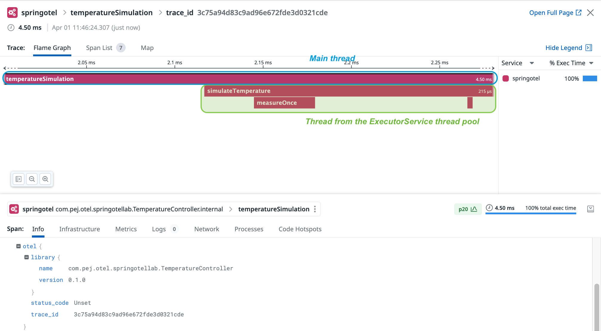
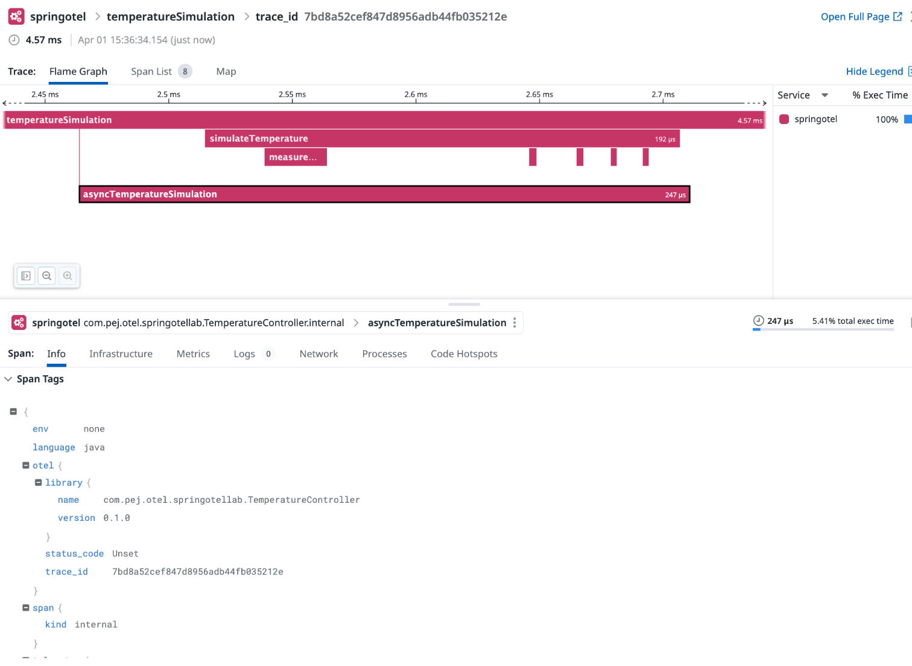
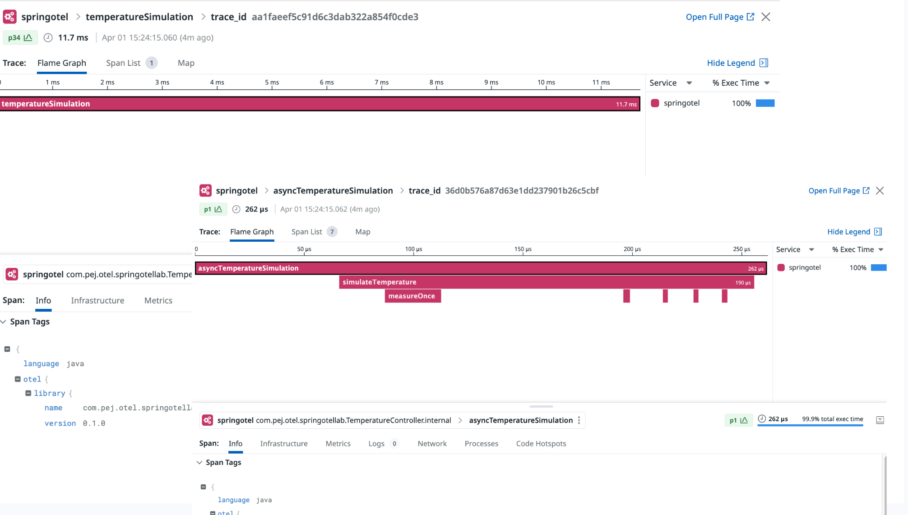
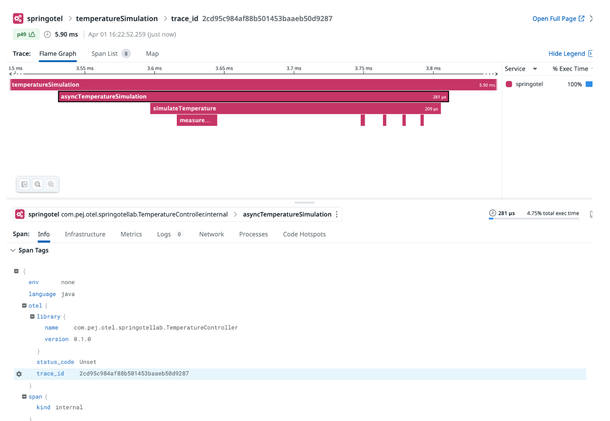

# Manual tracing: Asynchronous activities and tracing across thread boundaries


## Goal of this activity

As applications grow in complexity, they often leverage the power of concurrency and parallelism to perform multiple tasks simultaneously, improving throughput and latency. However, this introduces challenges in maintaining a coherent understanding of the application's behavior, especially when tasks span multiple threads or services. Tracing, a critical aspect of observability, allows developers and operators to follow the journey of requests as they traverse through these distributed and concurrent environments.
In this chapter, we will explore key concepts such as context management, the role of spans in tracing, and how to effectively propagate trace context across asynchronous boundaries.


## Main steps

* Starting from section 03's solution.
* Adjusting the code to introduce an `ExecutorService` to handle the temperature simulation asynchronously.
* Highlighting the importance of context activation and scope management. 
* Build, run and test.


## Modifying the `TemperatureController` class


As ususal, bootsrap the containers
(Make sure the `DD_API_KEY` and `DD_SITE` env variables are set)   

```bash
[root@pt-instance-1:~/oteljavalab]$ DD_SITE="your_site_value" DD_API_KEY="your_api_key_value" docker-compose up -d
Creating otel-collector ... done
Creating springotel     ... done
```

1. Accessing the container

<pre style="font-size: 12px">
[root@pt-instance-1:~/oteljavalab]$ docker exec -it springotel bash
[root@pt-instance-1:~/oteljavalab]$ 
</pre>


2. Going to the directory containing our project

<pre style="font-size: 12px">
[root@pt-instance-1:~/oteljavalab]$ cd section11/activity
[root@pt-instance-1:~/oteljavalab/section11/activity]$
</pre>


3. Code change


The current implementation we have is as follows:


**_Before_**

```java
    @GetMapping("/simulateTemperature")
    public List<Integer> index(@RequestParam("location") Optional<String> location, @RequestParam("measurements") Optional<Integer> measurements) {

        Span span = tracer.spanBuilder("temperatureSimulation")
                          .startSpan();
        try (Scope scope = span.makeCurrent()) {

            if (measurements.isEmpty()) {
                throw new ResponseStatusException(
                    HttpStatus.BAD_REQUEST,
                    "Missing measurements parameter",
                    null);
            }

            thermometer.setTemp(20, 35);
            List<Integer> result = thermometer.simulateTemperature(measurements.get());

            if (location.isPresent()) {
                logger.info("Temperature simulation for {}: {}", location.get(), result);
            } else {
                logger.info("Temperature simulation for an unspecified location: {}", result);
            }
            return result;
        } catch(Throwable t) {
            span.recordException(t);
            throw t;
        } finally {
            span.end();
        }
    }
```


In order to make our code asynchronous we introduce an `ExecutorService` to show how context propagation can be handled when our implementation invovles `Threads` 

**_After_**

```java
import io.opentelemetry.context.Context;
import java.util.concurrent.Callable;
import java.util.concurrent.ExecutorService;
import java.util.concurrent.Executors;
import java.util.concurrent.Future;

    @GetMapping("/simulateTemperature")
    public List<Integer> index(@RequestParam("location") Optional<String> location,
                               @RequestParam("measurements") Optional<Integer> measurements) throws ExecutionException, InterruptedException {

        Span span = tracer.spanBuilder("temperatureSimulation")
                          .startSpan();
        try (Scope scope = span.makeCurrent()) {

            if (measurements.isEmpty()) {
                throw new ResponseStatusException(
                    HttpStatus.BAD_REQUEST,
                    "Missing measurements parameter",
                    null);
            }

            Context currentContext = Context.current();
            Future<List<Integer>> futureResult = executorService.submit(() -> {
                try (Scope ignored = currentContext.makeCurrent()) {
                    thermometer.setTemp(20, 35);
                    return thermometer.simulateTemperature(measurements.get());
                }
            });

            List<Integer> result = futureResult.get(); 

            if (location.isPresent()) {
                logger.info("Temperature simulation for {}: {}", location.get(), result);
            } else {
                logger.info("Temperature simulation for an unspecified location: {}", result);
            }
            return result;
        } catch(Throwable t) {
            span.recordException(t);
            throw t;
        } finally {
            span.end();
        }
    }
    
```


The code change involves the use of Java's `ExecutorService` and the `Future` API, which are key components for executing tasks asynchronously in Java. Here's a breakdown of the change:

1. **ExecutorService submission**:
    - The `ExecutorService` provides a way to asynchronously execute tasks in a separate thread or a pool of threads. In the code, `executorService.submit()` is used to submit a callable task that performs the temperature simulation.
    - The callable task encapsulates the logic that was previously executed synchronously within the `index` method.

2. **Context propagation**:
    - `Context.current()` is called outside the lambda expression to capture the current tracing context before submitting the task. This ensures that the trace context is available and can be propagated into the asynchronous task, allowing for consistent tracing across thread boundaries.
    - Inside the callable task, `try (Scope ignored = currentContext.makeCurrent())` makes the captured context active in the thread that executes the task, ensuring that any spans created within this context are correctly associated with the original trace.
    - The `try-with-resource` pattern closes the `Scope ignored` by the end of the `try` block to disable the captured context after the task complete. This prevent the context to leak if the worker thread is part of a thread pool and reused later for some other tasks.

3. **Asynchronous execution**:
    - The temperature simulation logic within the callable (`thermometer.simulateTemperature(measurements.get())`) is now executed in a separate thread managed by the `ExecutorService`. This allows the main thread to continue without waiting for the simulation to complete, thereby achieving asynchrony.
    - However, `futureResult.get()` is called immediately after submitting the task, which blocks the main thread until the asynchronous task completes and returns its result. While this call is synchronous and waits for the result, the actual computation of temperatures is performed asynchronously.

4. **Future API for result retrieval**:
    - The `Future` API is used to handle the result of the asynchronous operation. The `Future<List<Integer>> futureResult` object represents the pending result of the temperature simulation. Calling `futureResult.get()` retrieves the result once the computation is done, effectively synchronizing back at this point to obtain the asynchronous task's outcome.


This approach to making the temperature simulation asynchronous allows for better utilization of system resources by freeing up the main thread to handle other tasks while the temperature simulation runs in parallel. However, the immediate call to `futureResult.get()` for the result means the code will wait for the temperature simulation to complete before moving on, maintaining a synchronous flow from the caller's perspective despite the asynchronous execution of the task.


### Observations

When running the service (See the instructions to build, run and test [here](#build)), we will get the exact same pattern in the trace. And the span hierarchy will look the same with one major difference from the synchronous approach.
The main thread was handling the `temperatureSimulation` span while both `simulateTemperature` and `measureOnce` spans were controlled by a speparate  Thread from the `ExecutorService`.

<p align="left">
  
</p>


**Important notes:**
The above may lead to a common misconception about spans and how threads are attached to them.

In reality during the lifecycle of a span, multiple threads can contribute to the overall processing captured by that span. This is true for many distributed, and asynchronous systems where operations initiated by a single request can be handled by different threads or multiple services across a distributed environment. The span, in such cases, represents the overall operation or unit of work, not just the execution path in a single thread.

Keeping in mind that:

1. **Span and context propagation:** The ability to propagate spans and their context across threads (or even across process boundaries in a microservice environment) is a fundamental part of distributed tracing. This propagation ensures that even when different parts of a single logical operation are handled by separate threads, services, or components, they can all be linked together in a single trace. This allows for a comprehensive view of the operation from start to finish.


1. **Trace integrity:** The integrity of a trace, meaning its ability to accurately represent the flow of execution across different components and threads, relies on correctly managing the context. By making the appropriate context `current` in each execution thread and properly starting and ending spans, the trace effectively represents the overall operation, including all its concurrent or sequential parts.


## Importance of context activation in more complex scenarios

The previous example showed how we could pass the context from one to another. But real-life implementations can introduce tricky challenges that could yield unexpected behavior if not securing and managing properly context activation.

In the above code example we saw that inside the callable task, we used this pattern

```java
Context currentContext = Context.current();
executorService.submit(() -> {
    try (Scope ignored = currentContext.makeCurrent()) {
        // Code here. Any spans created in this block will be part of the trace defined by currentContext.
    }
});
```

to activate the current context in the thread executing the task. This ensures that any spans created within this context are correctly associated with the original trace.


Let's now create a new span `asyncTemperatureSimulation` in the task itself:

Modifying 

```java
            Context currentContext = Context.current();
            Future<List<Integer>> futureResult = executorService.submit(() -> {
                try (Scope ignored = currentContext.makeCurrent()) {
                    thermometer.setTemp(20, 35);
                    return thermometer.simulateTemperature(measurements.get());
                }
            });
```

By

```java
            Context currentContext = Context.current();
            Callable<List<Integer>> task = () -> {
                try (Scope ignored = currentContext.makeCurrent()) {
                    Span newSpan = tracer.spanBuilder("asyncTemperatureSimulation")
                                         .startSpan();
                    try {
                        // Perform the simulated temperature measurement
                        // within the new span's context
                        thermometer.setTemp(20, 35);
                        // Return the result for future use
                        return thermometer.simulateTemperature(measurements.get());
                    } finally {
                        newSpan.end();
                    }
                }
            };

```


The modification seems to comply with the requirement of activating the context for our new span. But in doing so the span will get created but what will happen in this case is that the span (in Thermometer) expected to be child of newSpan will actually become child of parentSpan.

The screenshot below shows that the `asyncTemperatureSimulation` is displayed as a child of the `temperatureSimulation` one. Which is not what we want.

<p align="left">
  
</p>


One could think of a mistake by seeing these two lines inverted:

```java
                try (Scope ignored = currentContext.makeCurrent()) {
                    Span newSpan = tracer.spanBuilder("asyncTemperatureSimulation")
                                         .startSpan();
                ...
                }
```

Now let's try to correct this with:


```java
    
    Context currentContext = Context.current();
    Callable<List<Integer>> task = () -> {
    Span newSpan = tracer.spanBuilder("asyncTemperatureSimulation")
                         .startSpan();
    try (Scope newScope = newSpan.makeCurrent()) {
        // Now newSpan is the current span, and its Context is active.
        // Any spans created in this block will have newSpan as their parent.
        thermometer.setTemp(20, 35);
        return thermometer.simulateTemperature(measurements.get());
    } finally {
        newSpan.end();
    }
};
```

By running and testing it again, we actually get another unexpected behavior:

The parent span `parentSpan` will not be recognized as the actual parent span for `newSpan`. The span will be created and started but as if it didn't have a parent. In fact in the above we activated the wrong context (we activated the context of `newSpan` instead of reusing `currentContext`)

This can be seen in the following screenshot where the trace is "broken" meaning that we actually get two distinct traces (different trace ids) and one span (`temperatureSimulation`) started from the main thread stands alone. And the other spans and subsequent spans are started in the task are contained in another trace. This shows that the context was not in effect propagated.


<p align="left">
  
</p>


### How to fix this? ###

In order to get around these issues we would need to introduce the corresponding scope for `currentContext` make it a current and then create and start `newSpan` and activaate the corresponding context.


```java
Context currentContext = Context.current();
Callable<List<Integer>> task = () -> {
    // Activating the context captured outside the Callable to maintain the trace context
    try (Scope ignored = currentContext.makeCurrent()) {
        // Within this scope, 'parentSpan' is the active span
        Span newSpan = tracer.spanBuilder("asyncTemperatureSimulation")
                             .startSpan();
        try (Scope newScope = newSpan.makeCurrent()) {
            // Now 'newSpan' is the current span, and its context is active.
            // Any spans created in this block will have 'newSpan' as their parent,
            // which in turn has 'parentSpan' as its parent.
            thermometer.setTemp(20, 35);
            return thermometer.simulateTemperature(measurements.get());
        } finally {
            newSpan.end(); // End 'newSpan' after its work is done
        }
    }
};
```

The general idea is to follow this type of pattern to ensure that we get the right span hierarchy. 


```java
Span parentSpan = tracer.spanBuilder("parent")
                        .startSpan();
try (Scope parentScope = parentSpan.makeCurrent()) {
    // Any activity within the parent span's context
    
    Span childSpan = tracer.spanBuilder("child")
                           .startSpan();
    try (Scope childScope = childSpan.makeCurrent()) {
        // Child span is now current
        // Any activity within the child span's context
    } finally {
        childSpan.end(); // Ending the child span
    }
    
    // At this point, even though the child span has ended,
    // we're still within the parentSpan's scope due to the try-with-resources block.
    // The parent span does not automatically become "current" again after the child span ends;
    // it remains current because its scope has not been exited.
} finally {
    parentSpan.end(); // Ending the parent span
}
```

Now here is the result we get:

<p align="left">
  
</p>

This time the spans are reordered and get displayed as expected.

> [!NOTE]
> Important to note that exiting a scope doesn't automatically revert and activate the preceding context per se.  
> When a child span has ended, we're still within the parentSpan's scope due to the try-with-resources block.
> The parent span does not automatically become "current" again after the child span ends;
> it remains current because its scope has not been exited.


### Simplifying our code ###

**Method 1:** Using the `Context.wrap()` method

The Context interface provides a `wrap()` method that simplifies a bit the implementation by removing some of the boiler plate code:

```java
Context currentContext = Context.current();
Callable<List<Integer>> task = currentContext.wrap(() -> {
    Span newSpan = tracer.spanBuilder("asyncTemperatureSimulation")
                         .startSpan();
    try (Scope newScope = newSpan.makeCurrent()) {
        // Now 'newSpan' is the current span, and its context is active.
        // Any spans created in this block will have 'newSpan' as their parent,
        // which in turn has 'parentSpan' as its parent.
        thermometer.setTemp(20, 35);
        return thermometer.simulateTemperature(measurements.get());
    } finally {
        newSpan.end(); // End 'newSpan' after its work is done
    }
});
```


**Method 2:** Using the `Context.taskWrapping()` method

This approach is even more concise and preferred, and consists of decorating an `ExecutorService` with current context propagation.


```java
            ExecutorService wrappedExecutorService = Context.taskWrapping(executorService);

            Callable<List<Integer>> task = () -> {
                Span newSpan = tracer.spanBuilder("asyncTemperatureSimulation")
                                     .startSpan();
                try (Scope newScope = newSpan.makeCurrent()) {
                    thermometer.setTemp(20, 35);
                    return thermometer.simulateTemperature(measurements.get());
                } finally {
                    newSpan.end();
                }
            };

            Future<List<Integer>> futureResult = wrappedExecutorService.submit(task);
            List<Integer> result = futureResult.get();
```

The benefit of these two methods is that they do not require to alter the task implementation by decoupling and speparating concerns.   


## Build, run and test the application <a name="build"></a>

<pre style="font-size: 12px">
[root@pt-instance-1:~/oteljavalab/section11/activity]$ gradle build

BUILD SUCCESSFUL in 4s
4 actionable tasks: 4 executed

[root@pt-instance-1:~/oteljavalab/section11/activity]$ java -jar build/libs/springotel-0.0.1-SNAPSHOT.jar 
2024-04-01T14:29:09.636Z  INFO 899 --- [           main] c.p.o.s.TemperatureApplication           : Starting TemperatureApplication v0.0.1-SNAPSHOT using Java 17.0.9 with PID 899 (/root/oteljavalab/section11/activity/build/libs/springotel-0.0.1-SNAPSHOT.jar started by root in /root/oteljavalab/section11/activity)
2024-04-01T14:29:09.647Z  INFO 899 --- [           main] c.p.o.s.TemperatureApplication           : No active profile set, falling back to 1 default profile: "default"
2024-04-01T14:29:11.242Z  INFO 899 --- [           main] o.s.b.w.embedded.tomcat.TomcatWebServer  : Tomcat initialized with port 8080 (http)
2024-04-01T14:29:11.258Z  INFO 899 --- [           main] o.apache.catalina.core.StandardService   : Starting service [Tomcat]
2024-04-01T14:29:11.258Z  INFO 899 --- [           main] o.apache.catalina.core.StandardEngine    : Starting Servlet engine: [Apache Tomcat/10.1.18]
2024-04-01T14:29:11.309Z  INFO 899 --- [           main] o.a.c.c.C.[Tomcat].[localhost].[/]       : Initializing Spring embedded WebApplicationContext
2024-04-01T14:29:11.312Z  INFO 899 --- [           main] w.s.c.ServletWebServerApplicationContext : Root WebApplicationContext: initialization completed in 1500 ms
2024-04-01T14:29:12.196Z  INFO 899 --- [           main] o.s.b.w.embedded.tomcat.TomcatWebServer  : Tomcat started on port 8080 (http) with context path ''
2024-04-01T14:29:12.217Z  INFO 899 --- [           main] c.p.o.s.TemperatureApplication           : Started TemperatureApplication in 3.298 seconds (process running for 3.983)

</pre>

Generate a request from another terminal using curl **from within the container**

<pre style="font-size: 12px">

[root@pt-instance-1:~/oteljavalab/section11/activity]$ curl "localhost:8080/simulateTemperature?measurements=5&location=Paris"

[21,28,29,35,27]
</pre>


## Tearing down the services

Exit the container

<pre style="font-size: 12px">
[root@pt-instance-1:~/oteljavalab/section11/activity]$ exit
[root@pt-instance-1:~/oteljavalab/section11/activity]$ 
</pre>

Graceful shutdown

<pre style="font-size: 12px">
[root@pt-instance-1:~/oteljavalab/section11/activity]$ docker-compose down
Stopping otel-collector ... done
Stopping springotel     ... done
Removing otel-collector ... done
Removing springotel     ... done
</pre>


## End

