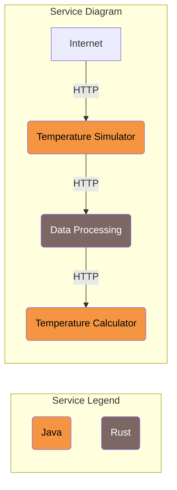

# Overview

In this section a Rust application is being added to the workshop.
This exercise is only meant to familiarize yourself with the structure of the new
application (directory structure, file names) but also the steps to follow to build, run and test it.
There won't be much change in the code yet.

## Architecture

You have been using Temperature Simulator and Temperature Calculator throughout this course
and both services are already communicating with each other.

The Rust application is a data processing service that is placed between Simulator and Calculator.



The service receives a request from Simulator at `/processTemperature`, does some processing and
if everything is good sends a request to Calculator.

## Features

### Simulate requests pre-processing

The service process the requests, before forwarding them to Calculator.

### Logging

Received and Sent requests, as well as errors, are configured to be logged.

## How it works

The application consists of two Rust files:

1. **main:**: The entry point to the Rust Data Processing application, responsible for launching the server.
2. **data_processing**: This module defines a HTTP endpoint that, when called, performs a simulated processing check,
retrieves temperature data from a configurable external service, and returns this data as a response

## Usage

You would keep using the application as you were before.

Simply send a GET request to the `/simulateTemperature` endpoint with the desired number of measurements and,
optionally, a location. The application will return a list of simulated temperature readings for the specified conditions.

Example request:

```shell
curl "localhost:8080/simulateTemperature?measurements=5&location=Paris"
```

This request would simulate five temperature measurements for Paris, returning a list of integers representing the temperatures.

The difference now, is that all requests from Temperature Simulator to Temperature Calculator will go through the Data Processing service.
