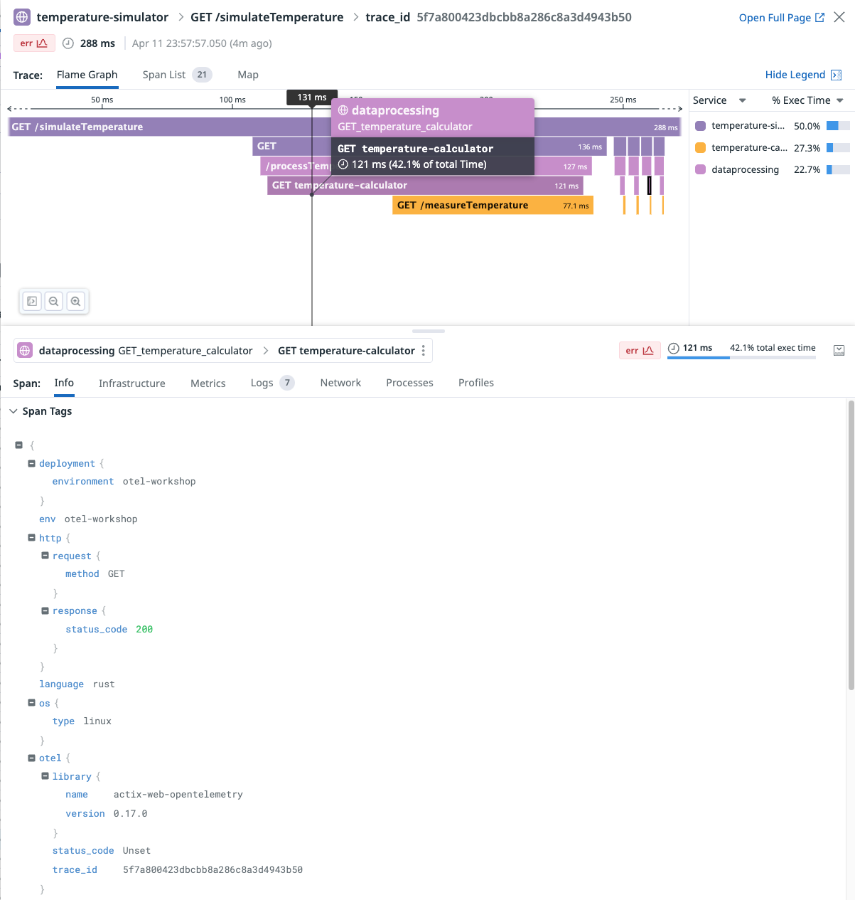

# Using instrumentation library to instrument Rust

## Goal of this activity

In this section of the lab, you will instrument the data processing service using a
instrumentation library to start producing OpenTelemetry Traces.

## Steps

After getting familiarized with the data processing service in section 12, now you will go through following:

1. Add the required dependencies to the `Cargo.toml` file.
2. Create a Rust module that holds all the initialization of OpenTelemetry.
3. Refactor `main.rs` and `data_processing.rs` to add the required steps to get your code instrumented.
4. Build the instrumented data processing service.
5. Configure the environment variables
6. Run the whole application containing the following services:
    - Temperature Simulator
    - Data Processing
    - Temperature Calculator
7. Send requests to the Temperature Simulator endpoint to produce some traces.
8. Visualize the trace in Datadog.

### 1. Add the dependencies

In the IDE open the file `data-processing/Cargo.toml` and add the following dependencies to it:

```toml
actix-web-opentelemetry = { version = "0.17.0", features = ["sync-middleware", "awc"] }
opentelemetry = { version = "0.22", features = ["trace", "metrics"] }
opentelemetry_sdk = { version = "0.22", features = ["rt-tokio", "metrics"]}
opentelemetry-otlp = { version = "0.15.0", features = ["metrics", "tokio", "trace"] }
```

In here you have added OpenTelemetry dependencies, as well as `actix-web-opentelemetry` that is
an instrumentation library for the Rust web framework the data processing uses.

### 2. Create a telemetry module

Now that the dependencies were added, create a file under `data-processing/src` named `telemetry_conf.rs`.

Add the following content to the file:

```rust
use opentelemetry::global;
use opentelemetry_otlp;
use opentelemetry_sdk::{
    propagation::TraceContextPropagator,
    resource::{
        EnvResourceDetector, OsResourceDetector, ProcessResourceDetector, ResourceDetector,
        SdkProvidedResourceDetector, TelemetryResourceDetector,
    },
    runtime, trace as sdktrace, Resource,
};

use std::time::Duration;

fn get_resource_attr() -> Resource {
    let os_resource = OsResourceDetector.detect(Duration::from_secs(0));
    let process_resource = ProcessResourceDetector.detect(Duration::from_secs(0));
    let sdk_resource = SdkProvidedResourceDetector.detect(Duration::from_secs(0));
    let env_resource = EnvResourceDetector::new().detect(Duration::from_secs(0));
    let telemetry_resource = TelemetryResourceDetector.detect(Duration::from_secs(0));

    os_resource
        .merge(&process_resource)
        .merge(&sdk_resource)
        .merge(&env_resource)
        .merge(&telemetry_resource)
}

pub fn init_tracer() -> () {
    global::set_text_map_propagator(TraceContextPropagator::new());

    opentelemetry_otlp::new_pipeline()
        .tracing()
        .with_exporter(opentelemetry_otlp::new_exporter().tonic())
        .with_trace_config(sdktrace::config().with_resource(get_resource_attr()))
        .install_batch(runtime::Tokio)
        .expect("pipeline install error");
}
```

This module is composed by 2 functions:

- `get_resource_attr`: This function is responsible for constructing an OpenTelemetry `Resource`,
which represents a collection of attributes that describe the service or application being monitored.
Resources are used to enrich telemetry data, making it easier to identify and correlate
across different parts of a distributed system.
- `init_tracer`: This function initializes the OpenTelemetry tracing for the application and sets up
the following:
  - `TraceContextPropagator`: which is responsible for extracting and injecting trace context from and into carriers (like HTTP headers).
  - OpenTelemetry OTLP exporter: which is responsible for exporting the generated Traces in OTLP format.
  - Trace configuration: which adds the resource attributes to all produced Traces.

### 3. Refactor the code

Now that the module `telemetry_conf` was created, you can refer to it and refactor the other files to instrument the code.

#### main.rs

First lets open `main.rs` and add the following functions and module to the scope:

```rust
use actix_web_opentelemetry::RequestTracing;
mod telemetry_conf;
use telemetry_conf::init_tracer;
```

Once you have that, now you can call `init_tracer()` and add `RequestTracing` to the request handling pipeline.

```rust
#[actix_web::main]
async fn main() -> std::io::Result<()> {
    let _ = SimpleLogger::init(LevelFilter::Info, Config::default());
    init_tracer();

    HttpServer::new(|| App::new().wrap(RequestTracing::new()).service(process_temp))
        .bind(("0.0.0.0", 9000))?
        .run()
        .await
}
```

In Actix Web, middleware is a way to inject logic into the request handling pipeline.
The `RequestTracing` middleware is wrapped around the application with `.wrap(RequestTracing::new())`.
This means that for every HTTP request that the Actix Web server handles, the middleware will execute its logic.

Your code should be looking something like this"

```rust
use actix_web::{App, HttpServer};
use actix_web_opentelemetry::RequestTracing;

mod data_processing;
use data_processing::process_temp;

use log::LevelFilter;
use simplelog::{Config, SimpleLogger};

mod telemetry_conf;
use telemetry_conf::init_tracer;

#[actix_web::main]
async fn main() -> std::io::Result<()> {
    let _ = SimpleLogger::init(LevelFilter::Info, Config::default());
    init_tracer();

    HttpServer::new(|| App::new().wrap(RequestTracing::new()).service(process_temp))
        .bind(("0.0.0.0", 9000))?
        .run()
        .await
}
```

#### data_processing.rs

The RequestTracing middleware is instrumenting and generating Traces to all incoming request, but what about
outgoing requests?

The `data_processing.rs` is responsible for doing some processing, and if nothing goes wrong
it calls the Temperature Calculator. This call is not instrumented yet, so lets do it.

For this one, we just need to bring this function to the scope:

```rust
use actix_web_opentelemetry::ClientExt;
```

And add call `trace_request()` from your client:

```rust
let mut response = client
        .get(temp_calculator_addr)
        .trace_request()
        .send()
        .await
        .map_err(|err| io::Error::new(io::ErrorKind::Other, err.to_string()))?;
```

That's it. Now outgoing requests are also instrumented.

Your final code, should look like this:

```rust
use actix_web::{get, Responder};
use actix_web_opentelemetry::ClientExt;
use log::{info, warn};
use std::env;
use std::io;

#[get("/processTemperature")]
pub async fn process_temp() -> impl Responder {
    if do_processing().await {
        let resp = get_temperature().await.unwrap();
        return format!("{resp}");
    }

    warn!("Error processing temperature");
    format!("Temperature error")
}

async fn do_processing() -> bool {
    info!("Processing request");
    tokio::time::sleep(tokio::time::Duration::from_millis(1)).await;
    true
}

async fn get_temperature() -> io::Result<String> {
    let client = awc::Client::new();
    let temp_calculator_addr = format!(
        "{}{}",
        env::var("TEMP_CALCULATOR_ADDR").unwrap(),
        "/measureTemperature"
    );

    info!("Requesting temperature from: {}", temp_calculator_addr);

    let mut response = client
        .get(temp_calculator_addr)
        .trace_request()
        .send()
        .await
        .map_err(|err| io::Error::new(io::ErrorKind::Other, err.to_string()))?;

    let bytes = response
        .body()
        .await
        .map_err(|err| io::Error::new(io::ErrorKind::Other, err.to_string()))?;

    std::str::from_utf8(&bytes)
        .map(|s| s.to_owned())
        .map_err(|err| io::Error::new(io::ErrorKind::Other, err))
}
```

### 4. Build the instrumented data processing

Your Data Processing service is properly instrumented and ready to go.

To build it, you need to open a terminal and run the following from the root folder:

```shell
docker compose -f docker-compose-section13.yaml build dataprocessing
```

If no errors are raised you are good to go. Otherwise, take a look at the
solution folder to check if you have missed something.

### 5. Configure the environment variables

To be able to send the produced telemetry data to Datadog, you must set the following environment variables:

- `DD_SITE_PARAMETER`
- `DD_API_KEY`

You can append them to the `docker compose up` command, like this:

```shell
DD_SITE_PARAMETER="your_site_parameter" DD_API_KEY="your_api_key_value" docker compose -f docker-compose-section13.yaml up -d
```

Or, you can create a file named `.env` in your root folder, with the following content:

```txt
DD_SITE_PARAMETER=your_site_parameter
DD_API_KEY=your_api_key_value
```

Every `docker compose` command you run, will add the values in the `.env` file as environment variables.

### 6. Run the whole application

Your new service is created and ready to be executed. To do so, run the following
command from the root folder:

```shell
docker compose -f docker-compose-section13.yaml up -d
```

This command starts 4 containers:

- `otelcol`: OpenTelemetry collector configured to receive telemetry data in OTLP and export telemetry data using the Datadog exporter.
- `temperature-calculator`
- `dataprocessing`
- `temperature-simulator`

### 7. Send requests to the application

As you were doing before, simply send a curl command to the Temperature Simulator service:

```shell
curl "localhost:8080/simulateTemperature?measurements=5&location=Paris"
```

### 8. Visualize the Trace in Datadog


